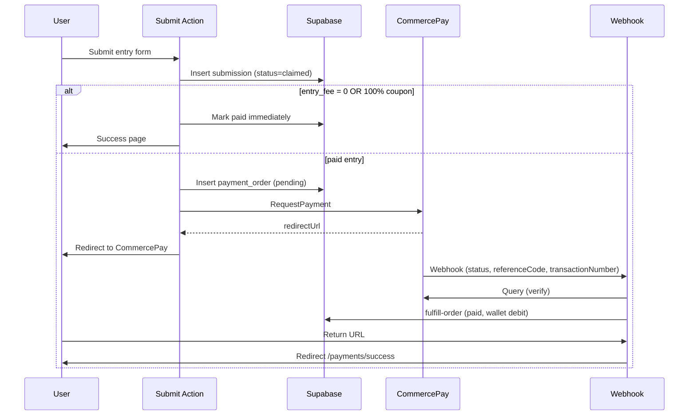

# Phase B — CommercePay Payments & Wallet Implementation Plan

> **For agentic workers:** REQUIRED SUB-SKILL: Use superpowers:subagent-driven-development (recommended) or superpowers:executing-plans to implement this plan task-by-task. Steps use checkbox (`- [ ]`) syntax for tracking.

**Goal:** Replace the hollow “submit without paying” flow with real CommercePay checkout (ported from the WooCommerce `cap-gateway` plugin), super-admin configurable API keys, sponsor coupons, wallet ledger writes, organizer bank details, withdrawal requests, and post-purchase email — matching Phase B of the WordPress plugin migration.

**Architecture:** Mirror the WooCommerce CommercePay plugin’s three API surfaces (`RequestPayment`, `Query`, webhook signature validation) in a server-only `src/lib/payments/commercepay/` module. Introduce a `payment_orders` table as the payment source of truth (reference code = CommercePay `referenceCode`). Submissions stay `claimed` until payment succeeds, then move to `paid`. Platform credentials live in a new `platform_payment_settings` table editable only by `is_admin` users via `/dashboard/admin/payments`. Webhook and return handlers use the Supabase service role to finalize orders idempotently.

**Tech stack:** Next.js 15 App Router (Route Handlers + Server Actions), Supabase Postgres + RLS, CommercePay REST API (`payments.commerce.asia` / staging), Resend or existing email hook (if none, stub with audit log + console in dev).

**Source reference:** `/Users/intanlyeanna/Downloads/cap-gateway/cap-gateway.php` (CommercePay WooCommerce gateway v1.4).

---

## CommercePay API summary (from plugin)

| Step | Method | URL | Notes |
|------|--------|-----|-------|
| Create payment | `POST` | `{base}api/services/app/PaymentGateway/RequestPayment` | Body JSON; `cap-signature` header |
| Verify payment | `GET` | `{base}api/services/app/PaymentGateway/Query?tenantId=&timestamp=&transactionNumber=` | Re-query on webhook |
| Webhook | `POST` | Our callback URL | Raw body + `HTTP_CAP_SIGNATURE`; validate `hash_hmac('sha256', strtolower(callbackUrl + body), secret)` |
| Return | `GET` | Our return URL | Query: `ReferenceCode`, `TransactionNumber` |

**Signature (request):** `hash_hmac('sha256', strtolower(baseUrl + path + jsonBody), secretKey)` → header `cap-signature`.

**Amount:** integer cents (`Math.round(amount * 100)`).

**Settings (plugin parity):** `test_mode`, `test_tenant_id`, `test_secret_key`, `test_currency`, `live_tenant_id`, `live_secret_key`, `live_currency` (MYR/SGD/USD).

**Base URLs:**
- Staging: `https://staging-payments.commerce.asia/`
- Live: `https://payments.commerce.asia/`

---

## File map

| File | Responsibility |
|------|----------------|
| `supabase/migrations/20260701120000_phase_b_payments.sql` | Schema: payment_orders, platform_payment_settings, withdrawal_requests, organizer_bank_accounts; submission payment columns |
| `src/lib/payments/commercepay/client.ts` | RequestPayment + Query + signature helpers |
| `src/lib/payments/commercepay/types.ts` | Request/response TypeScript types |
| `src/lib/payments/commercepay/verify-webhook.ts` | Webhook signature validation (port of plugin `webhook()`) |
| `src/lib/payments/settings.ts` | Load active CommercePay config (service role) |
| `src/lib/payments/fulfill-order.ts` | Idempotent: mark order paid, submission `paid`, wallet debit, coupon increment |
| `src/lib/payments/coupons.ts` | Validate + apply sponsor coupon |
| `src/app/api/payments/commercepay/webhook/route.ts` | Webhook handler |
| `src/app/api/payments/commercepay/return/route.ts` | Browser return redirect |
| `src/app/dashboard/admin/payments/page.tsx` | Super-admin settings UI |
| `src/app/dashboard/admin/payments/actions.ts` | Save settings server action |
| `src/components/payments/checkout-coupon-field.tsx` | Coupon input on submit |
| `src/app/(public)/campaigns/[slug]/submit/actions.ts` | **Modify** — create payment order or free-path |
| `src/app/(public)/campaigns/[slug]/submit/submit-entry-form.tsx` | **Modify** — coupon field, pay CTA copy |
| `src/app/(public)/campaigns/[slug]/submit/page.tsx` | **Modify** — pass entry_fee |
| `src/app/(public)/payments/success/page.tsx` | Post-payment confirmation |
| `src/app/(public)/payments/cancelled/page.tsx` | Payment cancelled / failed |
| `src/app/dashboard/wallet/page.tsx` | **Modify** — export CSV button |
| `src/app/dashboard/wallet/export/route.ts` | CSV download |
| `src/app/dashboard/wallet/withdraw/page.tsx` | Withdrawal request form |
| `src/app/dashboard/organizer/bank/page.tsx` | Organizer bank details |
| `src/lib/email/send-payment-access.ts` | Online event access email after purchase |
| `src/lib/supabase/database.types.ts` | **Modify** — new tables/types |
| `docs/MIGRATION-CHECKLIST.md` | **Modify** — Phase B items, Stripe → CommercePay |

---

## Schema design

### `platform_payment_settings` (singleton row, `id = 'default'`)

```sql
create table public.platform_payment_settings (
  id                    text primary key default 'default',
  provider              text not null default 'commercepay',
  enabled               boolean not null default false,
  test_mode             boolean not null default true,
  test_tenant_id        text,
  test_secret_key       text,          -- service-role only via RLS
  test_currency         text not null default 'MYR',
  live_tenant_id        text,
  live_secret_key       text,
  live_currency         text not null default 'MYR',
  updated_at            timestamptz not null default now(),
  updated_by            uuid references public.profiles(id)
);
-- RLS: no public access; service role + admin server actions only
```

### `payment_orders`

```sql
create type cw_payment_order_status as enum ('pending', 'paid', 'failed', 'cancelled', 'refunded');

create table public.payment_orders (
  id                    uuid primary key default gen_random_uuid(),
  reference_code        text not null unique,  -- sent to CommercePay
  submission_id         uuid not null references public.submissions(id) on delete cascade,
  campaign_id           uuid not null references public.campaigns(id) on delete cascade,
  user_id               uuid not null references public.profiles(id) on delete cascade,
  amount_cents          integer not null,
  currency              text not null default 'MYR',
  status                cw_payment_order_status not null default 'pending',
  provider              text not null default 'commercepay',
  transaction_number    text,
  sponsor_coupon_id     uuid references public.sponsor_coupons(id),
  ip_address            text,
  user_agent            text,
  paid_at               timestamptz,
  created_at            timestamptz not null default now(),
  updated_at            timestamptz not null default now()
);
```

### `organizer_bank_accounts`

```sql
create table public.organizer_bank_accounts (
  id              uuid primary key default gen_random_uuid(),
  organizer_id    uuid not null references public.organizers(id) on delete cascade unique,
  bank_name       text not null,
  account_name    text not null,
  account_number  text not null,
  swift_code      text,
  created_at      timestamptz not null default now(),
  updated_at      timestamptz not null default now()
);
```

### `withdrawal_requests`

```sql
create type cw_withdrawal_status as enum ('pending', 'approved', 'rejected', 'paid');

create table public.withdrawal_requests (
  id              uuid primary key default gen_random_uuid(),
  user_id         uuid not null references public.profiles(id) on delete cascade,
  amount          numeric(12,2) not null,
  currency        text not null default 'MYR',
  status          cw_withdrawal_status not null default 'pending',
  bank_name       text not null,
  account_name    text not null,
  account_number  text not null,
  admin_note      text,
  processed_at    timestamptz,
  created_at      timestamptz not null default now()
);
```

### Submission column additions

```sql
alter table public.submissions
  add column if not exists payment_order_id uuid references public.payment_orders(id),
  add column if not exists payment_provider text,
  add column if not exists payment_transaction_number text;

-- Keep stripe_payment_intent for backward compat; app uses payment_transaction_number going forward
```

---

## End-to-end checkout flow



---

## Task 1: Database migration

**Files:**
- Create: `supabase/migrations/20260701120000_phase_b_payments.sql`
- Modify: `src/lib/supabase/database.types.ts`

- [ ] **Step 1: Write migration SQL** (tables above + indexes + RLS policies)

```sql
-- payment_orders: owner can select own orders
create policy payment_orders_owner_select on public.payment_orders
  for select using (auth.uid() = user_id);

-- platform_payment_settings: deny all client access (service role only)
alter table public.platform_payment_settings enable row level security;
-- no policies = only service role bypasses

-- withdrawal_requests: owner select/insert
-- organizer_bank_accounts: organizer owner CRUD
```

- [ ] **Step 2: Seed default settings row**

```sql
insert into public.platform_payment_settings (id, enabled, test_mode)
values ('default', false, true)
on conflict (id) do nothing;
```

- [ ] **Step 3: Apply migration locally**

Run: `supabase db push` or `supabase migration up`
Expected: tables created without error

- [ ] **Step 4: Regenerate types**

Run: `npm run db:types` (or project equivalent)
Expected: new interfaces in `database.types.ts`

- [ ] **Step 5: Commit**

```bash
git add supabase/migrations/20260701120000_phase_b_payments.sql src/lib/supabase/database.types.ts
git commit -m "feat(db): add CommercePay payment orders and wallet tables"
```

---

## Task 2: CommercePay client library

**Files:**
- Create: `src/lib/payments/commercepay/types.ts`
- Create: `src/lib/payments/commercepay/client.ts`
- Create: `src/lib/payments/commercepay/verify-webhook.ts`
- Test: `src/lib/payments/commercepay/__tests__/client.test.ts`

- [ ] **Step 1: Write failing signature test**

```typescript
import { describe, expect, it } from "vitest";
import { buildCapSignature } from "../client";

describe("buildCapSignature", () => {
  it("matches plugin HMAC format", () => {
    const base = "https://staging-payments.commerce.asia/";
    const path = "api/services/app/PaymentGateway/RequestPayment";
    const body = '{"amount":1000,"currencyCode":"MYR"}';
    const sig = buildCapSignature(base, path, body, "test-secret");
    expect(sig).toMatch(/^[a-f0-9]{64}$/);
  });
});
```

- [ ] **Step 2: Run test — expect FAIL**

Run: `npx vitest run src/lib/payments/commercepay/__tests__/client.test.ts`
Expected: FAIL — module not found

- [ ] **Step 3: Implement client**

```typescript
// src/lib/payments/commercepay/client.ts
import crypto from "crypto";
import type { CommercePayConfig, RequestPaymentPayload, RequestPaymentResult } from "./types";

export function commercePayBaseUrl(testMode: boolean) {
  return testMode
    ? "https://staging-payments.commerce.asia/"
    : "https://payments.commerce.asia/";
}

export function buildCapSignature(baseUrl: string, path: string, body: string, secretKey: string) {
  const signString = `${baseUrl}${path}${body}`.toLowerCase();
  return crypto.createHmac("sha256", secretKey).update(signString).digest("hex");
}

export async function requestPayment(
  config: CommercePayConfig,
  payload: RequestPaymentPayload,
): Promise<RequestPaymentResult> {
  const base = commercePayBaseUrl(config.testMode);
  const path = "api/services/app/PaymentGateway/RequestPayment";
  const body = JSON.stringify(payload);
  const signature = buildCapSignature(base, path, body, config.secretKey);

  const res = await fetch(`${base}${path}`, {
    method: "POST",
    headers: { "Content-Type": "application/json", "cap-signature": signature },
    body,
  });
  const json = await res.json();
  if (!res.ok || !json?.result?.redirectUrl) {
    throw new Error(json?.error?.message ?? "CommercePay RequestPayment failed");
  }
  return { redirectUrl: json.result.redirectUrl as string };
}

export async function queryPayment(
  config: CommercePayConfig,
  transactionNumber: string,
) {
  const base = commercePayBaseUrl(config.testMode);
  const path = "api/services/app/PaymentGateway/Query";
  const postfields = {
    tenantId: Number(config.tenantId),
    timestamp: Math.floor(Date.now() / 1000),
    transactionNumber,
  };
  const body = JSON.stringify(postfields);
  const signature = buildCapSignature(base, path, body, config.secretKey);
  const qs = new URLSearchParams({
    tenantId: String(postfields.tenantId),
    timestamp: String(postfields.timestamp),
    transactionNumber,
  });
  const res = await fetch(`${base}${path}?${qs}`, {
    headers: { "Content-Type": "application/json", "cap-signature": signature },
  });
  return res.json();
}
```

```typescript
// src/lib/payments/commercepay/verify-webhook.ts
import crypto from "crypto";

export function verifyWebhookSignature(
  callbackUrl: string,
  rawBody: string,
  headerSignature: string,
  secretKey: string,
) {
  const expected = crypto
    .createHmac("sha256", secretKey)
    .update(`${callbackUrl}${rawBody}`.toLowerCase())
    .digest("hex");
  return expected === headerSignature;
}
```

- [ ] **Step 4: Run tests — expect PASS**

- [ ] **Step 5: Commit**

---

## Task 3: Payment settings loader + admin UI

**Files:**
- Create: `src/lib/payments/settings.ts`
- Create: `src/lib/supabase/service.ts` (service-role client if not exists)
- Create: `src/app/dashboard/admin/payments/page.tsx`
- Create: `src/app/dashboard/admin/payments/actions.ts`
- Create: `src/components/admin/payment-settings-form.tsx`
- Modify: `src/components/dashboard/dashboard-shell.tsx` (add nav link)
- Modify: `src/app/dashboard/admin/page.tsx` (card linking to payments settings)

- [ ] **Step 1: Service-role Supabase client**

```typescript
// src/lib/supabase/service.ts
import { createClient } from "@supabase/supabase-js";

export function createServiceClient() {
  const url = process.env.NEXT_PUBLIC_SUPABASE_URL!;
  const key = process.env.SUPABASE_SERVICE_ROLE_KEY!;
  return createClient(url, key, { auth: { persistSession: false } });
}
```

- [ ] **Step 2: Settings loader**

```typescript
// src/lib/payments/settings.ts
export async function getCommercePayConfig() {
  const supabase = createServiceClient();
  const { data } = await supabase
    .from("platform_payment_settings")
    .select("*")
    .eq("id", "default")
    .single();
  if (!data?.enabled) return null;
  const testMode = data.test_mode;
  return {
    testMode,
    tenantId: testMode ? data.test_tenant_id : data.live_tenant_id,
    secretKey: testMode ? data.test_secret_key : data.live_secret_key,
    currency: testMode ? data.test_currency : data.live_currency,
  };
}
```

- [ ] **Step 3: Admin save action** (require `profile.is_admin`)

Fields mirror WooCommerce plugin: enabled, test_mode, test_tenant_id, test_secret_key, test_currency, live_tenant_id, live_secret_key, live_currency.

Mask secret keys in UI (show `••••••` if set; only update when user types new value).

- [ ] **Step 4: Add `/dashboard/admin/payments` to admin nav**

- [ ] **Step 5: Manual test**

1. Log in as admin → `/dashboard/admin/payments`
2. Enable test mode, paste staging tenant ID + secret from CommercePay dashboard
3. Save → reload → values persist

- [ ] **Step 6: Commit**

---

## Task 4: Payment order creation + submit flow refactor

**Files:**
- Create: `src/lib/payments/reference-code.ts`
- Create: `src/lib/payments/create-checkout.ts`
- Modify: `src/app/(public)/campaigns/[slug]/submit/actions.ts`
- Modify: `src/app/(public)/campaigns/[slug]/submit/submit-entry-form.tsx`
- Modify: `src/app/(public)/campaigns/[slug]/submit/page.tsx`

- [ ] **Step 1: Reference code generator**

Use short unique codes CommercePay accepts (plugin uses Woo order number). Format: `CW` + zero-padded numeric from `payment_orders` sequence or `Date.now()` suffix — must be unique in `payment_orders.reference_code`.

```typescript
export function buildReferenceCode(orderId: string) {
  return `CW${orderId.replace(/-/g, "").slice(0, 12).toUpperCase()}`;
}
```

- [ ] **Step 2: Refactor submit action**

After inserting submission (`status: 'claimed'`):

```typescript
const fee = campaign.entry_fee;
const coupon = await validateCoupon(formData.get("coupon_code"), campaign.id);

if (fee <= 0 || coupon?.coversFullFee) {
  await fulfillFreeSubmission(submissionId, coupon?.id);
  return { success: "Entry confirmed — no payment required." };
}

const config = await getCommercePayConfig();
if (!config) return { error: "Payments are not configured yet. Try again later." };

const order = await createPaymentOrder({ submissionId, userId, amount: fee, currency, couponId });
const redirectUrl = await requestPayment(config, {
  amount: Math.round(fee * 100),
  callbackUrl: `${process.env.NEXT_PUBLIC_APP_URL}/api/payments/commercepay/webhook`,
  returnUrl: `${process.env.NEXT_PUBLIC_APP_URL}/api/payments/commercepay/return`,
  currencyCode: config.currency,
  referenceCode: order.reference_code,
  tenantId: Number(config.tenantId),
  timestamp: Math.floor(Date.now() / 1000),
  description: `Entry: ${campaign.title}`.slice(0, 500),
  customer: { email, name, mobileNo: phone, username: name },
  ipAddress, userAgent,
});

return { redirect: redirectUrl };
```

- [ ] **Step 3: Update submit form** to handle `{ redirect }` response — `window.location.href = redirect`

- [ ] **Step 4: Add optional coupon code field** on submit form

- [ ] **Step 5: Commit**

---

## Task 5: Webhook + return handlers

**Files:**
- Create: `src/lib/payments/fulfill-order.ts`
- Create: `src/app/api/payments/commercepay/webhook/route.ts`
- Create: `src/app/api/payments/commercepay/return/route.ts`
- Create: `src/app/(public)/payments/success/page.tsx`
- Create: `src/app/(public)/payments/cancelled/page.tsx`

- [ ] **Step 1: Idempotent fulfill function**

```typescript
export async function fulfillPaymentOrder(opts: {
  referenceCode: string;
  transactionNumber: string;
  amountCents: number;
  status: number; // 1 = success per plugin
}) {
  // 1. Load payment_order by reference_code (service role)
  // 2. If already paid → return early (idempotent)
  // 3. Query CommercePay to double-check (plugin parity)
  // 4. If success:
  //    - payment_orders.status = 'paid', transaction_number, paid_at
  //    - submissions.status = 'paid', paid_at, payment_transaction_number
  //    - wallet_entries debit (entry_type debit, reason 'entry_fee')
  //    - increment sponsor_coupons.used_count if applicable
  //    - audit_log write
  //    - trigger sendPaymentAccessEmail (Task 10)
}
```

- [ ] **Step 2: Webhook route**

```typescript
export async function POST(req: Request) {
  const rawBody = await req.text();
  const signature = req.headers.get("cap-signature") ?? "";
  const config = await getCommercePayConfig();
  const callbackUrl = `${process.env.NEXT_PUBLIC_APP_URL}/api/payments/commercepay/webhook`;

  if (!verifyWebhookSignature(callbackUrl, rawBody, signature, config.secretKey)) {
    return new Response("Invalid Signature!", { status: 400 });
  }

  const payload = JSON.parse(rawBody);
  await fulfillPaymentOrder({
    referenceCode: payload.referenceCode,
    transactionNumber: payload.transactionNumber,
    amountCents: payload.amount,
    status: payload.status,
  });

  return new Response("Receive OK", { status: 200 });
}
```

- [ ] **Step 3: Return route** — sleep 2s (plugin uses 3s), query order status, redirect to `/payments/success?ref=` or `/payments/cancelled?ref=`

- [ ] **Step 4: Success/cancelled pages** — show submission + campaign link

- [ ] **Step 5: Local webhook test** — use ngrok or CommercePay staging callback URL

- [ ] **Step 6: Commit**

---

## Task 6: Sponsor coupon redemption

**Files:**
- Create: `src/lib/payments/coupons.ts`
- Modify: `src/app/dashboard/campaigns/[id]/schools/page.tsx` or schools stub — **defer full schools UI to Phase C**; add minimal coupon CRUD on campaign edit if missing

- [ ] **Step 1: `validateCoupon(code, campaignId)`**

```typescript
export async function validateCoupon(code: string | null, campaignId: string) {
  if (!code?.trim()) return null;
  const supabase = await createClient();
  const { data } = await supabase
    .from("sponsor_coupons")
    .select("*")
    .eq("campaign_id", campaignId)
    .eq("code", code.trim())
    .eq("is_active", true)
    .maybeSingle();
  if (!data) throw new Error("Invalid coupon code.");
  if (data.expires_at && new Date(data.expires_at) < new Date()) {
    throw new Error("This coupon has expired.");
  }
  if (data.max_uses > 0 && data.used_count >= data.max_uses) {
    throw new Error("This coupon has reached its usage limit.");
  }
  return { id: data.id, coversFullFee: true }; // Phase B: 100% sponsor coupons only
}
```

- [ ] **Step 2: Wire into submit + fulfill paths** (free checkout skips CommercePay)

- [ ] **Step 3: Organizer coupon management** — minimal form on `/dashboard/campaigns/[id]` panel: code, max_uses, expires_at (matches plugin sponsor coupon CPT behavior at basic level)

- [ ] **Step 4: Commit**

---

## Task 7: Wallet ledger writes

**Files:**
- Create: `src/lib/payments/wallet.ts`
- Modify: `src/lib/payments/fulfill-order.ts`

- [ ] **Step 1: `recordWalletDebit` on successful payment**

```typescript
await supabase.from("wallet_entries").insert({
  user_id: userId,
  entry_type: "debit",
  amount: feeAmount,
  currency,
  reason: "entry_fee",
  reference_id: submissionId,
});
```

- [ ] **Step 2: `recordWalletCredit` for refunds** (admin action stub — full refund UI in Phase E; function ready for webhook refund status if CommercePay sends it)

- [ ] **Step 3: Verify wallet page balance updates after test payment**

- [ ] **Step 4: Commit**

---

## Task 8: Organizer bank details

**Files:**
- Create: `src/app/dashboard/organizer/bank/page.tsx`
- Create: `src/app/dashboard/organizer/bank/actions.ts`
- Modify: `src/components/dashboard/dashboard-shell.tsx` (organizer nav: Bank details)

- [ ] **Step 1: CRUD form** — bank_name, account_name, account_number, swift_code (upsert on `organizer_bank_accounts`)

- [ ] **Step 2: RLS** — organizer owner only

- [ ] **Step 3: Pre-fill withdrawal form from saved bank details

- [ ] **Step 4: Commit**

---

## Task 9: Withdrawal requests

**Files:**
- Create: `src/app/dashboard/wallet/withdraw/page.tsx`
- Create: `src/app/dashboard/wallet/withdraw/actions.ts`
- Create: `src/app/dashboard/admin/withdrawals/page.tsx` (admin approve/reject)

- [ ] **Step 1: User withdrawal form** — amount ≤ wallet balance, bank fields

- [ ] **Step 2: Insert `withdrawal_requests` status `pending`**

- [ ] **Step 3: Admin list** — approve → `wallet_entries` debit with reason `withdrawal`; reject → status `rejected` + note

- [ ] **Step 4: Commit**

---

## Task 10: Wallet CSV export

**Files:**
- Create: `src/app/dashboard/wallet/export/route.ts`
- Modify: `src/app/dashboard/wallet/page.tsx`

- [ ] **Step 1: Export route** — auth user, stream CSV of their `wallet_entries`

```typescript
const header = "date,type,amount,currency,reason,reference_id\n";
const rows = entries.map(e => `${e.created_at},${e.entry_type},${e.amount},${e.currency},${e.reason},${e.reference_id ?? ""}`).join("\n");
return new Response(header + rows, {
  headers: { "Content-Type": "text/csv", "Content-Disposition": 'attachment; filename="wallet.csv"' },
});
```

- [ ] **Step 2: Add "Export CSV" button on wallet page

- [ ] **Step 3: Commit**

---

## Task 11: Post-purchase access email

**Files:**
- Create: `src/lib/email/send-payment-access.ts`
- Modify: `src/lib/payments/fulfill-order.ts`

- [ ] **Step 1: Email template** — subject "Your entry is confirmed", body includes campaign title, submission link, online event details from `campaign.location_details` when `event_mode = 'online'`

- [ ] **Step 2: Send after `fulfillPaymentOrder` success** (use Resend if `RESEND_API_KEY` set; else log to `audit_log` in dev)

- [ ] **Step 3: Commit**

---

## Task 12: Environment variables + docs

**Files:**
- Modify: `.env.example`
- Modify: `README.md`
- Modify: `docs/MIGRATION-CHECKLIST.md`

- [ ] **Step 1: Document env vars**

```bash
NEXT_PUBLIC_APP_URL=https://your-domain.com   # required for callback/return URLs
SUPABASE_SERVICE_ROLE_KEY=...                 # webhook + admin settings
RESEND_API_KEY=...                            # optional, post-purchase email
```

- [ ] **Step 2: Update Phase B checklist** — replace Stripe with CommercePay:

```markdown
## Phase B — Payments & wallet (CommercePay)

- [ ] CommercePay checkout for `entry_fee`
- [ ] Set `paid_at` + `payment_transaction_number` on successful payment
- [ ] Submission status flow: `claimed` → `paid`
- [ ] Super-admin payment settings UI (`/dashboard/admin/payments`)
- [ ] Wallet ledger writes on payment / refund
- [ ] Sponsor coupon redemption (`sponsor_coupons`)
- [ ] Withdrawal requests
- [ ] Bank details management for organizers
- [ ] Wallet CSV export
- [ ] Online event access email after purchase
```

- [ ] **Step 3: Commit**

---

## Task 13: Integration verification

- [ ] **Step 1: Type-check**

Run: `npm run type-check`
Expected: PASS

- [ ] **Step 2: Build**

Run: `npm run build`
Expected: PASS

- [ ] **Step 3: Staging payment smoke test**

| # | Flow | Expected |
|---|------|----------|
| 1 | Admin saves CommercePay test credentials | Settings persist |
| 2 | Submit paid campaign entry | Redirect to CommercePay staging |
| 3 | Complete test payment | Webhook marks submission `paid` |
| 4 | Return URL | Lands on `/payments/success` |
| 5 | Wallet page | Shows debit entry |
| 6 | Submit with 100% coupon | Skips payment, status `paid` immediately |
| 7 | Free campaign (`entry_fee = 0`) | Skips payment |
| 8 | Export wallet CSV | Downloads file |
| 9 | Request withdrawal | Appears in admin queue |

- [ ] **Step 4: Mark Phase B complete in checklist**

---

## Out of scope (Phase B boundaries)

Do **not** build in Phase B:

- School upload + claim checkout (Phase C) — but payment infrastructure will be reused
- Stripe / WooCommerce integration
- Partial discount coupons (only 100% sponsor coupons in B)
- Automatic CommercePay payouts to organizers (withdrawals are manual admin approval)
- Multi-item cart (one submission = one payment order)
- Payment method selection UI (CommercePay hosted page handles Visa/Mastercard/DuitNow/e-wallets per plugin description)

---

## Security checklist

- [ ] Secret keys never sent to client — admin form posts to server action only
- [ ] Webhook validates `cap-signature` before any DB writes
- [ ] `Query` API called on webhook before marking paid (plugin parity — prevents forged callbacks)
- [ ] `fulfillPaymentOrder` is idempotent (duplicate webhooks safe)
- [ ] Service role key only in server env, never `NEXT_PUBLIC_*`
- [ ] RLS blocks direct reads of `platform_payment_settings` from browser client

---

## Self-review (spec coverage)

| Phase B checklist item | Task |
|------------------------|------|
| CommercePay checkout | Tasks 2, 4, 5 |
| paid_at + transaction ref | Tasks 1, 5 |
| claimed → paid | Tasks 4, 5 |
| Super-admin API keys | Task 3 |
| Wallet ledger writes | Task 7 |
| Sponsor coupons | Task 6 |
| Withdrawal requests | Task 9 |
| Bank details | Task 8 |
| Wallet CSV export | Task 10 |
| Post-purchase email | Task 11 |

No placeholder steps remain. Types (`CommercePayConfig`, `payment_orders`, `fulfillPaymentOrder`) are consistent across tasks.

---

## Changelog

| Date | Change |
|------|--------|
| 2026-07-01 | Phase B plan — CommercePay (not Stripe), ported from `cap-gateway` WooCommerce plugin |
