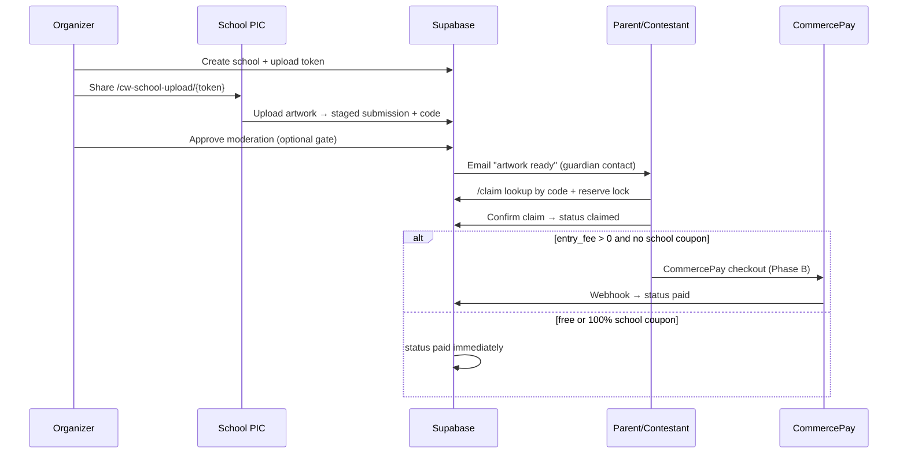

# Phase C — School Upload & Claim Pipeline Implementation Plan

> **For agentic workers:** REQUIRED SUB-SKILL: Use superpowers:subagent-driven-development (recommended) or superpowers:executing-plans to implement this plan task-by-task. Steps use checkbox (`- [ ]`) syntax for tracking.

**Goal:** Implement the full school PIC upload → staged submission → parent claim → CommercePay checkout pipeline, matching the WordPress plugin (`class-cw-school-upload.php`, `class-cw-staged-submissions.php`, `class-cw-claim-flow.php`) and all 15 Phase C checklist items.

**Architecture:** Schools and upload tokens remain organizer-private (existing RLS). PIC upload is token-gated at `/cw-school-upload/[token]` — the server validates the token via `createAdminClient()` and inserts `status: staged` rows without a logged-in user. Parents claim via `/claim` (logged in): lookup by `submission_code`, acquire a 15-minute reservation lock, confirm details, set `contestant_id`, move to `claimed`, then reuse Phase B CommercePay (`startCommercePayCheckout` / `fulfillFreeSubmission`) with school-scoped sponsor coupons. Submission codes use `CCC-MM-SEQ` (school code + month + sequence). Organizer dashboard at `/dashboard/campaigns/[id]/schools` becomes the control centre (schools CRUD, tokens, exports, moderation of staged rows).

**Tech stack:** Next.js 15 App Router, Supabase Postgres + RLS + service role for token/claim writes, Storage `artworks` bucket (from Phase A), CommercePay checkout (from Phase B), Resend email (optional, audit log fallback).

**Plugin reference files:** `includes/class-cw-school-upload.php`, `includes/class-cw-claim-flow.php`, `includes/class-cw-staged-submissions.php`, `includes/class-cw-sponsor-coupons.php`

**Depends on:** Phase A (custom fields, artwork upload), Phase B (CommercePay, sponsor coupons, `fulfillFreeSubmission`).

---

## End-to-end flow



---

## Submission code format (`CCC-MM-SEQ`)

| Part | Source | Example |
|------|--------|---------|
| `CCC` | `schools.school_code` (3 chars, zero-padded) | `001` |
| `MM` | Upload month (`01`–`12`) | `07` |
| `SEQ` | Monotonic 6-digit sequence per `campaign_id` + month | `000123` |

Stored as:
- `submission_code` = `001-07-000123`
- `school_code` = `001`
- `month_code` = `07`
- `seq_code` = `000123`

Campaign `serial_code` (3-digit listing ID) is shown in the organizer UI and used in bulk export headers; school code drives the prefix per plugin behaviour.

---

## File map

| File | Responsibility |
|------|----------------|
| `supabase/migrations/20260702120000_phase_c_schools.sql` | Sequence RPC, claim RLS helpers, optional `guardian_email` on submissions |
| `src/lib/schools/submission-code.ts` | Generate `CCC-MM-SEQ` via RPC |
| `src/lib/schools/validate-upload-token.ts` | Token lookup + expiry check |
| `src/lib/schools/sync-school-coupon.ts` | Create/update `sponsor_coupons` row when school has `coupon_code` |
| `src/lib/schools/claim-reservation.ts` | Reserve / release / expire claim locks |
| `src/lib/schools/claim-submission.ts` | Full claim: assign contestant, status → claimed, trigger checkout |
| `src/lib/email/send-artwork-ready.ts` | Email parent when staged row approved |
| `src/lib/email/send-submission-linked.ts` | Email when claim completes |
| `src/app/(public)/cw-school-upload/[token]/page.tsx` | PIC upload portal |
| `src/app/(public)/cw-school-upload/[token]/actions.ts` | Staged insert server action |
| `src/app/(public)/cw-school-upload/[token]/upload-form.tsx` | PIC form (student, artwork, custom fields) |
| `src/app/(public)/claim/page.tsx` | Code lookup landing |
| `src/app/(public)/claim/[code]/page.tsx` | Confirm + checkout |
| `src/app/(public)/claim/actions.ts` | Lookup, reserve, claim server actions |
| `src/app/dashboard/campaigns/[id]/schools/page.tsx` | **Rewrite** — schools + tokens + exports hub |
| `src/app/dashboard/campaigns/[id]/schools/actions.ts` | **Extend** — school CRUD, token gen, approve staged |
| `src/app/dashboard/campaigns/[id]/schools/schools-panel.tsx` | Schools repeater UI |
| `src/app/dashboard/campaigns/[id]/schools/tokens-panel.tsx` | Token list + copy link |
| `src/app/dashboard/campaigns/[id]/schools/staged-panel.tsx` | Staged submissions table + approve |
| `src/app/dashboard/campaigns/[id]/schools/export/codes/route.ts` | Bulk codes CSV/HTML |
| `src/app/dashboard/campaigns/[id]/schools/export/staged/route.ts` | Staged CSV export |
| `src/app/dashboard/campaigns/[id]/schools/export/qr/route.ts` | QR sheet HTML |
| `src/components/campaigns/campaign-form.tsx` | **Modify** — add `serial_code` field |
| `src/components/dashboard/dashboard-shell.tsx` | **Modify** — contestant "Claim entry" nav link |
| `src/lib/supabase/database.types.ts` | **Modify** if migration adds columns |
| `docs/MIGRATION-CHECKLIST.md` | **Modify** — tick Phase C when done |

---

## Schema additions (migration)

```sql
-- Atomic sequence for submission codes (avoids race on concurrent PIC uploads)
create table if not exists public.submission_code_counters (
  campaign_id   uuid not null references public.campaigns(id) on delete cascade,
  month_code    text not null,
  last_seq      integer not null default 0,
  primary key (campaign_id, month_code)
);

create or replace function public.next_submission_seq(p_campaign_id uuid, p_month_code text)
returns integer
language plpgsql
security definer
set search_path = public
as $$
declare
  v_seq integer;
begin
  insert into public.submission_code_counters (campaign_id, month_code, last_seq)
  values (p_campaign_id, p_month_code, 1)
  on conflict (campaign_id, month_code)
  do update set last_seq = public.submission_code_counters.last_seq + 1
  returning last_seq into v_seq;
  return v_seq;
end;
$$;

-- Optional: guardian email on staged rows (PIC collects at upload)
alter table public.submissions
  add column if not exists guardian_email text;

-- Staged rows: allow service role only for PIC insert (no new public INSERT policy)
-- Claim: contestants may update staged rows they have reserved
drop policy if exists submissions_claim_reserve on public.submissions;
create policy submissions_claim_reserve on public.submissions
  for update using (
    status = 'staged'
    and moderation_status = 'approved'
    and (
      claim_reserved_by is null
      or claim_reserved_by = auth.uid()
      or claim_reserved_until < now()
    )
  )
  with check (
    contestant_id = auth.uid()
    and status in ('staged', 'claimed')
  );
```

**Note:** PIC inserts always use `createAdminClient()` — tokens are validated server-side, never exposed via public RLS insert.

---

## Task 1: Database migration + submission code generator

**Files:**
- Create: `supabase/migrations/20260702120000_phase_c_schools.sql`
- Create: `src/lib/schools/submission-code.ts`
- Modify: `src/lib/supabase/database.types.ts`

- [ ] **Step 1: Write migration** (SQL above + `guardian_email` column)

- [ ] **Step 2: Implement code generator**

```typescript
// src/lib/schools/submission-code.ts
import { createAdminClient } from "@/lib/supabase/server";

export function formatSubmissionCode(schoolCode: string, monthCode: string, seq: number) {
  const ccc = schoolCode.padStart(3, "0").slice(0, 3);
  const mm = monthCode.padStart(2, "0").slice(0, 2);
  const seqPart = String(seq).padStart(6, "0");
  return {
    submission_code: `${ccc}-${mm}-${seqPart}`,
    school_code: ccc,
    month_code: mm,
    seq_code: seqPart,
  };
}

export async function allocateSubmissionCode(campaignId: string, schoolCode: string) {
  const supabase = createAdminClient();
  const monthCode = String(new Date().getMonth() + 1).padStart(2, "0");
  const { data, error } = await supabase.rpc("next_submission_seq", {
    p_campaign_id: campaignId,
    p_month_code: monthCode,
  });
  if (error) throw error;
  return formatSubmissionCode(schoolCode, monthCode, data as number);
}
```

- [ ] **Step 3: Apply migration** — `supabase db push`

- [ ] **Step 4: Commit**

```bash
git add supabase/migrations/20260702120000_phase_c_schools.sql src/lib/schools/submission-code.ts
git commit -m "feat(db): submission code sequence for school uploads"
```

---

## Task 2: Campaign `serial_code` in editor

**Files:**
- Modify: `src/components/campaigns/campaign-form.tsx`
- Modify: `src/app/dashboard/campaigns/actions.ts` (verify `serial_code` already saved)

- [ ] **Step 1: Add field to Basics card**

```tsx
<div className="space-y-2">
  <Label htmlFor="serial_code">Listing ID (3-digit, for submission codes)</Label>
  <Input
    id="serial_code"
    name="serial_code"
    maxLength={3}
    placeholder="002"
    defaultValue={defaults.serial_code ?? ""}
  />
</div>
```

- [ ] **Step 2: Verify `updateCampaignAction` / `createCampaignAction` persist `serial_code`**

- [ ] **Step 3: Commit**

---

## Task 3: School CRUD + coupon sync

**Files:**
- Create: `src/lib/schools/sync-school-coupon.ts`
- Modify: `src/app/dashboard/campaigns/[id]/schools/actions.ts`
- Create: `src/components/dashboard/schools/schools-panel.tsx`

- [ ] **Step 1: School CRUD actions**

```typescript
export async function saveSchoolAction(campaignId: string, formData: FormData) {
  // requireRole organizer + owns campaign
  // fields: school_code (3 char), school_name, city, country, coupon_code (optional)
  // upsert schools row
  // if coupon_code → syncSchoolCoupon(schoolId, campaignId, code)
}

export async function deleteSchoolAction(campaignId: string, schoolId: string) {
  // delete school (cascade tokens/coupons via FK)
}
```

- [ ] **Step 2: Coupon sync helper**

```typescript
// src/lib/schools/sync-school-coupon.ts
export async function syncSchoolCoupon(opts: {
  schoolId: string;
  campaignId: string;
  code: string;
}) {
  const supabase = createAdminClient();
  await supabase.from("sponsor_coupons").upsert(
    {
      campaign_id: opts.campaignId,
      school_id: opts.schoolId,
      code: opts.code.trim().toUpperCase(),
      max_uses: 0,
      is_active: true,
    },
    { onConflict: "code" },
  );
}
```

- [ ] **Step 3: Schools panel UI** — table of schools + add form (code, name, city, coupon)

- [ ] **Step 4: Only show school section when `campaign.enable_school_sponsors` is true

- [ ] **Step 5: Commit**

---

## Task 4: Upload token generation

**Files:**
- Modify: `src/app/dashboard/campaigns/[id]/schools/actions.ts`
- Create: `src/components/dashboard/schools/tokens-panel.tsx`
- Create: `src/lib/schools/validate-upload-token.ts`

- [ ] **Step 1: Token generation action**

```typescript
import crypto from "crypto";

export async function generateUploadTokenAction(campaignId: string, schoolId: string) {
  const token = crypto.randomBytes(32).toString("hex");
  const expiresAt = new Date();
  expiresAt.setDate(expiresAt.getDate() + 90);

  await supabase.from("upload_tokens").insert({
    token,
    campaign_id: campaignId,
    school_id: schoolId,
    school_code: school.school_code,
    expires_at: expiresAt.toISOString(),
  });

  return `${getAppUrl()}/cw-school-upload/${token}`;
}
```

- [ ] **Step 2: Token validator**

```typescript
export async function validateUploadToken(token: string) {
  const supabase = createAdminClient();
  const { data } = await supabase
    .from("upload_tokens")
    .select("*, schools:school_id(*), campaigns:campaign_id(id, slug, title, status, enable_design)")
    .eq("token", token)
    .maybeSingle();

  if (!data) return null;
  if (data.expires_at && new Date(data.expires_at) < new Date()) return null;
  if (data.campaigns?.status !== "published") return null;
  return data;
}
```

- [ ] **Step 3: Tokens panel** — list tokens per school, copy link button, expiry date, regenerate

- [ ] **Step 4: Commit**

---

## Task 5: Public PIC upload portal

**Files:**
- Create: `src/app/(public)/cw-school-upload/[token]/page.tsx`
- Create: `src/app/(public)/cw-school-upload/[token]/actions.ts`
- Create: `src/app/(public)/cw-school-upload/[token]/upload-form.tsx`

- [ ] **Step 1: Page** — validate token; show campaign + school name; 404 if invalid/expired

- [ ] **Step 2: PIC form fields**
  - Student name (required)
  - Guardian name + contact + email (optional but recommended)
  - Age + age bracket (if campaign has brackets)
  - Artwork file upload (required if `enable_design`)
  - Custom fields from campaign (`CustomFieldRenderer` pattern from Phase A)
  - Display generated code after success (read-only, from server response)

- [ ] **Step 3: Upload action**

```typescript
export async function picUploadAction(token: string, formData: FormData) {
  const ctx = await validateUploadToken(token);
  if (!ctx) return { error: "This upload link is invalid or expired." };

  const school = ctx.schools;
  const campaign = ctx.campaigns;
  const codes = await allocateSubmissionCode(campaign.id, school.school_code);

  // upload artwork to artworks bucket (reuse uploadPublicFile)
  // collect custom field_data

  await supabase.from("submissions").insert({
    campaign_id: campaign.id,
    school_id: school.id,
    school_code: codes.school_code,
    month_code: codes.month_code,
    seq_code: codes.seq_code,
    submission_code: codes.submission_code,
    student_name: studentName,
    guardian_name, guardian_contact, guardian_email,
    age, artwork_url,
    field_data,
    status: "staged",
    moderation_status: "pending",
    contestant_id: null,
  });

  return { success: "Uploaded", submissionCode: codes.submission_code };
}
```

- [ ] **Step 4: Camera capture** — use `<Input type="file" accept="image/*" capture="environment">` on mobile (plugin parity without custom camera JS)

- [ ] **Step 5: Commit**

---

## Task 6: Staged submissions moderation (organizer)

**Files:**
- Create: `src/components/dashboard/schools/staged-panel.tsx`
- Modify: `src/app/dashboard/campaigns/[id]/schools/actions.ts`

- [ ] **Step 1: List staged submissions** for campaign where `status = 'staged'`

- [ ] **Step 2: Approve / reject actions**

```typescript
export async function moderateStagedAction(submissionId: string, decision: "approved" | "rejected") {
  await supabase.from("submissions").update({
    moderation_status: decision,
    moderation_note: note,
  }).eq("id", submissionId);

  if (decision === "approved") {
    await sendArtworkReadyEmail(submissionId);
  }
}
```

- [ ] **Step 3: Gate claim flow** — only `moderation_status = 'approved'` rows are claimable

- [ ] **Step 4: Commit**

---

## Task 7: Email — artwork ready + submission linked

**Files:**
- Create: `src/lib/email/send-artwork-ready.ts`
- Create: `src/lib/email/send-submission-linked.ts`

- [ ] **Step 1: Artwork ready email** — sent to `guardian_email` or `guardian_contact` when staged row approved

```typescript
// Subject: "Your child's artwork is ready to claim — {campaign.title}"
// Body: submission code prominently displayed, link to /claim
// CTA: {APP_URL}/claim?code={submission_code}
```

- [ ] **Step 2: Submission linked email** — sent after successful claim (before or after payment per plugin)

- [ ] **Step 3: Resend if `RESEND_API_KEY` set; else `audit_log` (same pattern as Phase B)

- [ ] **Step 4: Commit**

---

## Task 8: Claim reservation lock

**Files:**
- Create: `src/lib/schools/claim-reservation.ts`

- [ ] **Step 1: Constants**

```typescript
export const CLAIM_LOCK_MINUTES = 15;
```

- [ ] **Step 2: Reserve function**

```typescript
export async function reserveStagedSubmission(submissionId: string, userId: string) {
  const supabase = createAdminClient();
  const until = new Date(Date.now() + CLAIM_LOCK_MINUTES * 60_000).toISOString();

  const { data: row } = await supabase
    .from("submissions")
    .select("id, status, moderation_status, claim_reserved_by, claim_reserved_until")
    .eq("id", submissionId)
    .single();

  if (row.status !== "staged" || row.moderation_status !== "approved") {
    throw new Error("This entry is not available to claim.");
  }

  const lockExpired = !row.claim_reserved_until || new Date(row.claim_reserved_until) < new Date();
  if (row.claim_reserved_by && row.claim_reserved_by !== userId && !lockExpired) {
    throw new Error("Someone else is claiming this code right now. Try again shortly.");
  }

  await supabase.from("submissions").update({
    claim_reserved_by: userId,
    claim_reserved_until: until,
  }).eq("id", submissionId);

  return until;
}
```

- [ ] **Step 3: Release on claim complete or checkout cancel

- [ ] **Step 4: Commit**

---

## Task 9: Public claim flow

**Files:**
- Create: `src/app/(public)/claim/page.tsx`
- Create: `src/app/(public)/claim/[code]/page.tsx`
- Create: `src/app/(public)/claim/actions.ts`
- Create: `src/lib/schools/claim-submission.ts`

- [ ] **Step 1: Lookup page** (`/claim`) — input submission code → redirect to `/claim/[code]`

- [ ] **Step 2: Lookup action** (requires login)

```typescript
export async function lookupClaimCodeAction(code: string) {
  const supabase = createAdminClient();
  const normalized = code.trim().toUpperCase();

  const { data } = await supabase
    .from("submissions")
    .select("id, student_name, status, moderation_status, campaign_id, school_id, campaigns:campaign_id(slug, title, entry_fee, currency)")
    .eq("submission_code", normalized)
    .maybeSingle();

  if (!data || data.status !== "staged") {
    return { error: "Code not found or already claimed." };
  }
  if (data.moderation_status !== "approved") {
    return { error: "This entry is still being reviewed by the organizer." };
  }

  await reserveStagedSubmission(data.id, userId);
  return { submission: data };
}
```

- [ ] **Step 3: Confirm page** — show student name, campaign, fee; confirm button

- [ ] **Step 4: Claim submission**

```typescript
export async function claimSubmissionAction(submissionId: string) {
  // verify reservation belongs to user
  // update: contestant_id = user.id, status = 'claimed', clear reservation
  // resolve school sponsor coupon if school_id set
  // if fee > 0 && no coupon → startCommercePayCheckout(...)
  // else → fulfillFreeSubmission(...)
  // sendSubmissionLinkedEmail(...)
  // create guardian_links row if guardian_email on submission (status pending_invite)
}
```

- [ ] **Step 5: Add "Claim entry" to contestant dashboard nav → `/claim`

- [ ] **Step 6: Commit**

---

## Task 10: School-scoped sponsor coupon at claim

**Files:**
- Modify: `src/lib/payments/coupons.ts`
- Modify: `src/lib/schools/claim-submission.ts`

- [ ] **Step 1: `resolveSchoolCoupon(campaignId, schoolId)`**

```typescript
export async function resolveSchoolCoupon(campaignId: string, schoolId: string | null) {
  if (!schoolId) return null;
  const { data } = await supabase
    .from("sponsor_coupons")
    .select("*")
    .eq("campaign_id", campaignId)
    .eq("school_id", schoolId)
    .eq("is_active", true)
    .maybeSingle();
  return data ? { id: data.id, coversFullFee: true } : null;
}
```

- [ ] **Step 2: Auto-apply at claim** — no manual coupon entry needed for school uploads

- [ ] **Step 3: Commit**

---

## Task 11: Guardian pre-link

**Files:**
- Modify: `src/lib/schools/claim-submission.ts`
- Modify: `src/app/(auth)/actions.ts` pattern for guardian_links

- [ ] **Step 1: On claim**, if `submission.guardian_email` set:

```typescript
await supabase.from("guardian_links").upsert(
  {
    student_id: userId,
    guardian_email: submission.guardian_email,
    guardian_name: submission.guardian_name ?? "Guardian",
    status: "pending_invite",
  },
  { onConflict: "student_id" }, // or unique on student+email if exists
);
```

- [ ] **Step 2: If guardian account exists with matching email → set `guardian_id` + `status: active`

- [ ] **Step 3: Commit** (full invite email is Phase D enhancement; log to audit for now)

---

## Task 12: Dashboard schools hub (rewrite page)

**Files:**
- Rewrite: `src/app/dashboard/campaigns/[id]/schools/page.tsx`

- [ ] **Step 1: Fetch** schools, tokens, staged count, coupons for campaign

- [ ] **Step 2: Layout tabs/sections:**
  1. Schools (Task 3 panel)
  2. Upload tokens (Task 4 panel)
  3. Staged submissions (Task 6 panel)
  4. Sponsor coupons (keep existing Phase B coupon UI, move to subsection)

- [ ] **Step 3: Gate entire page on `enable_school_sponsors` with helpful message if disabled

- [ ] **Step 4: Commit**

---

## Task 13: Bulk exports (codes CSV, staged CSV, QR sheet)

**Files:**
- Create: `src/app/dashboard/campaigns/[id]/schools/export/codes/route.ts`
- Create: `src/app/dashboard/campaigns/[id]/schools/export/staged/route.ts`
- Create: `src/app/dashboard/campaigns/[id]/schools/export/qr/route.ts`

- [ ] **Step 1: Staged CSV export**

```typescript
// GET .../export/staged
// Columns: submission_code, student_name, school_name, status, moderation_status, created_at, guardian_email
```

- [ ] **Step 2: Bulk codes CSV** — all approved staged rows with codes for printing

- [ ] **Step 3: QR HTML sheet** — install `qrcode` package; generate printable HTML page with QR per code linking to `{APP_URL}/claim?code={code}`

```bash
npm install qrcode
npm install -D @types/qrcode
```

```typescript
import QRCode from "qrcode";
const dataUrl = await QRCode.toDataURL(`${appUrl}/claim?code=${code}`);
```

- [ ] **Step 4: Add export buttons on schools dashboard

- [ ] **Step 5: Commit**

---

## Task 14: Integration verification

- [ ] **Step 1: Type-check** — `npm run type-check` → PASS

- [ ] **Step 2: Build** — `npm run build` → PASS

- [ ] **Step 3: Smoke test matrix**

| # | Flow | Expected |
|---|------|----------|
| 1 | Organizer adds school + generates token | Link copied, 90-day expiry |
| 2 | PIC opens token URL | Form loads with school name |
| 3 | PIC uploads artwork | `staged` row + `001-MM-NNNNNN` code shown |
| 4 | Organizer approves staged row | `moderation_status = approved`, email logged/sent |
| 5 | Parent looks up code at `/claim` | Reservation acquired |
| 6 | Parent confirms claim (paid campaign) | Redirect to CommercePay |
| 7 | Parent confirms claim (school coupon) | Instant `paid`, no payment |
| 8 | Second parent tries same code while reserved | Error message |
| 9 | Export staged CSV | Downloads valid CSV |
| 10 | QR sheet | Scannable link opens claim with code prefilled |

- [ ] **Step 4: Mark Phase C `[x]` in `docs/MIGRATION-CHECKLIST.md`

- [ ] **Step 5: Commit**

---

## Out of scope (Phase C boundaries)

Do **not** build in Phase C:

- Full guardian invite email + accept flow (minimal `guardian_links` upsert only)
- School bulk upload via CSV import (PIC form is one-at-a-time; bulk is export-only)
- PDF generation server-side (HTML print view + CSV is enough; PDF in Phase E reports)
- Public submission gallery
- Certificate auto-issue on claim
- WooCommerce-specific school upload camera JS (use native `capture` attribute)
- Changing CommercePay integration (reuse Phase B as-is)

---

## Security checklist

- [ ] Upload tokens are unguessable (32-byte hex minimum)
- [ ] Token validation always server-side via `createAdminClient()`
- [ ] PIC route never exposes other schools' data
- [ ] Claim lookup does not leak PII until user is logged in and holds reservation
- [ ] Reservation lock prevents double-claim race
- [ ] Only `approved` staged rows are claimable
- [ ] Organizer-only access to schools/tokens/staged lists (existing RLS)

---

## Self-review (spec coverage)

| Phase C checklist item | Task |
|------------------------|------|
| Schools CRUD | 3, 12 |
| Upload token generation (90-day) | 4 |
| `/cw-school-upload/[token]` | 5 |
| PIC form + custom fields | 5 |
| Staged insert | 5 |
| Submission code `CCC-MM-SEQ` | 1 |
| Parent pre-link (`guardian_links`) | 11 |
| Email artwork ready | 7 |
| Claim flow + checkout | 9, 10 |
| Claim reservation lock | 8 |
| School-scoped coupons | 3, 10 |
| Bulk codes CSV/HTML | 13 |
| Bulk QR sheet | 13 |
| Export staged CSV | 13 |
| Dashboard schools page | 12 |

All 15 items mapped. No placeholder steps.

---

## Changelog

| Date | Change |
|------|--------|
| 2026-07-01 | Phase C plan — school upload & claim pipeline |
