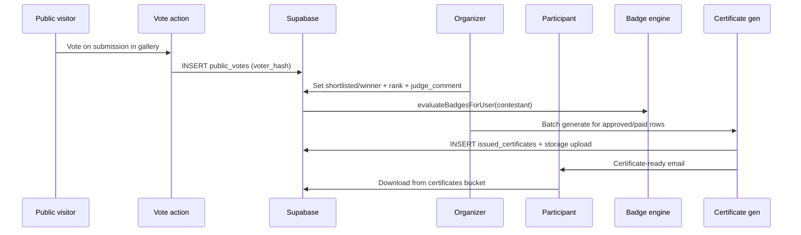

# Phase D — Engagement (Voting, Badges, Certificates) Implementation Plan

> **For agentic workers:** REQUIRED SUB-SKILL: Use superpowers:subagent-driven-development (recommended) or superpowers:executing-plans to implement this plan task-by-task. Steps use checkbox (`- [ ]`) syntax for tracking.
>
> **Implementation style:** Same as Phase B/C — implement **inline** in one session (no subagents unless the user asks). Run `npm run type-check` + `npm run build` before marking done.

**Goal:** Wire up the engagement layer that exists in schema/toggles but not in behaviour: public voting gallery, vote tracking, winner/shortlist workflow, extended judge review, badge auto-award + admin tools, and the full certificate pipeline (template → generate → download → email).

**Architecture:** Voting writes go through server actions using `createAdminClient()` (existing `public_votes` RLS has SELECT-only for public; no voter INSERT policy). Vote identity is an anonymous `voter_hash` (IP + User-Agent, same pattern as plugin). Gallery shows `paid`/`approved`/`shortlisted`/`winner` submissions when `campaign.enable_voting`. Badge rules live in a new `badge_rules` table; `evaluateBadgesForUser()` runs after key events (payment, shortlist, winner, certificate issue, organizer publish). Certificates: organizer uploads template + JSON layout on campaign; generation composes participant name/date onto template with `sharp`, optional PDF via `pdf-lib`, stores to private `certificates` bucket at `{user_id}/{campaign_id}-{submission_id}.png`, tracks rows in `issued_certificates`.

**Tech stack:** Next.js 15 App Router, Supabase Postgres + RLS + service role for votes/certs, Storage (`certificates` bucket exists), `sharp` + `pdf-lib`, Resend email (optional; audit log fallback like Phase B).

**Plugin reference files:** `includes/class-cw-certificate.php`, `includes/badges/class-cw-badges-engine.php`, `includes/class-cw-moderation.php`, `includes/class-cw-shortcodes.php` (public event detail / voting UI)

**Depends on:** Phase A (campaign editor, artwork upload), Phase B (paid submissions), Phase C (staged/claim pipeline). Phase F (design mockups) and Phase E (reports) are **out of scope**.

**Current state (~5–10% done):** `enable_voting` / `enable_certificate` toggles saved; `public_votes`, `badges`, `user_badges` tables exist; `/dashboard/badges` read-only; `/winners` page queries DB; review page has score + moderation note only; home `RecentWinnersBand` still uses static data.

---

## End-to-end flows



---

## Phase D checklist mapping (13 items)

| # | Checklist item | Task(s) |
|---|----------------|---------|
| 1 | Public voting gallery on campaign detail | 3, 4 |
| 2 | Vote tracking (`public_votes`, IP/user limits) | 2, 4 |
| 3 | Winner status + rank (`shortlisted`, `winner`) | 5 |
| 4 | Judge score + comment (extend review UI) | 5 |
| 5 | Badges auto-award engine (`user_badges` writes) | 6, 7 |
| 6 | Badge rule types (entries, certs, votes, tenure, etc.) | 6 |
| 7 | Manual badge award/revoke (admin) | 8 |
| 8 | Badge earn toast + email opt-in | 9 |
| 9 | Certificate template upload + layout (x, y, font) | 10 |
| 10 | Certificate PDF/image generation (`certificates` bucket) | 11 |
| 11 | Certificate download for participants | 12 |
| 12 | Certificate batch email send | 13 |
| 13 | Certificate-ready email trigger | 11, 13 |

---

## File map

| File | Responsibility |
|------|----------------|
| `supabase/migrations/20260703120000_phase_d_engagement.sql` | `badge_rules`, `issued_certificates`, layout columns, vote limits, `judge_comment`, storage policies |
| `src/lib/voting/voter-hash.ts` | Anonymous `voter_hash` from request headers |
| `src/lib/voting/cast-vote.ts` | Validate + insert vote + per-campaign limits |
| `src/lib/voting/vote-counts.ts` | Aggregate counts for gallery |
| `src/lib/badges/rules.ts` | Rule type definitions + evaluators |
| `src/lib/badges/engine.ts` | `evaluateBadgesForUser`, `awardBadge`, `revokeBadge` |
| `src/lib/badges/hooks.ts` | Thin wrappers called from payment/winner/cert flows |
| `src/lib/certificates/layout.ts` | Parse/validate `certificate_layout` JSON |
| `src/lib/certificates/generate.ts` | `sharp` composite + optional PDF |
| `src/lib/certificates/issue.ts` | Orchestrate generate + DB row + email |
| `src/lib/email/send-badge-earned.ts` | Badge unlock email (opt-in) |
| `src/lib/email/send-certificate-ready.ts` | Certificate download link email |
| `src/components/campaigns/voting-gallery.tsx` | Public gallery + vote buttons |
| `src/app/(public)/campaigns/[slug]/vote/actions.ts` | `castVoteAction` |
| `src/app/dashboard/campaigns/[id]/submissions/[subId]/page.tsx` | **Extend** — shortlist/winner/rank/judge_comment |
| `src/app/dashboard/campaigns/[id]/submissions/page.tsx` | **Extend** — filters, rank column |
| `src/app/dashboard/campaigns/[id]/certificates/page.tsx` | Batch generate + email hub |
| `src/app/dashboard/campaigns/[id]/certificates/actions.ts` | Generate batch, send emails |
| `src/app/dashboard/admin/badges/page.tsx` | Manual award/revoke |
| `src/app/dashboard/admin/badges/actions.ts` | Admin badge CRUD |
| `src/components/campaigns/certificate-layout-form.tsx` | Template upload + x/y/font fields |
| `src/components/campaigns/campaign-form.tsx` | **Modify** — certificate section when `enable_certificate` |
| `src/components/badges/badge-earned-toast.tsx` | Client toast from `?badge=` query |
| `src/app/dashboard/layout.tsx` or shell | **Modify** — mount toast listener |
| `src/app/dashboard/submissions/page.tsx` | **Modify** — certificate download links |
| `src/app/api/certificates/[id]/download/route.ts` | Signed redirect or stream from storage |
| `src/components/site/landing-sections.tsx` | **Modify** — `RecentWinnersBand` from DB |
| `src/components/campaigns/detail-sections.tsx` | **Modify** — mount `VotingGallery` when enabled |
| `src/app/(public)/campaigns/[slug]/page.tsx` | **Modify** — pass voting submissions |
| `src/lib/supabase/database.types.ts` | **Modify** — new tables/columns |
| `supabase/seed.sql` | **Extend** — badge rules seed for default badges |
| `docs/MIGRATION-CHECKLIST.md` | **Modify** — tick Phase D when done |

---

## Schema additions (migration)

```sql
-- Vote limit per visitor per campaign (plugin: typically 1–N votes per person)
alter table public.campaigns
  add column if not exists vote_limit_per_user integer not null default 1;

-- Certificate template layout (plugin: x, y, font, size, color, field keys)
alter table public.campaigns
  add column if not exists certificate_layout jsonb not null default '{
    "name": {"x": 400, "y": 320, "fontSize": 48, "fontFamily": "Helvetica", "color": "#1a1a1a", "align": "center"},
    "date": {"x": 400, "y": 400, "fontSize": 24, "fontFamily": "Helvetica", "color": "#666666", "align": "center"},
    "campaign_title": {"x": 400, "y": 260, "fontSize": 20, "fontFamily": "Helvetica", "color": "#444444", "align": "center"}
  }'::jsonb;

-- Separate judge notes from moderation notes
alter table public.submissions
  add column if not exists judge_comment text;

-- Badge notification tracking
alter table public.user_badges
  add column if not exists notified_at timestamptz;

-- Badge email opt-in (separate from marketing)
alter table public.profiles
  add column if not exists consent_badge_emails boolean not null default true;

-- Badge rules engine
do $$ begin
  create type cw_badge_rule_type as enum (
    'submission_count',       -- total paid/approved submissions by user
    'certificate_count',      -- issued_certificates for user
    'votes_cast',             -- public_votes cast by voter (via user link — optional Phase D: skip)
    'votes_received',         -- votes on user's submissions
    'shortlisted',            -- any submission shortlisted
    'campaign_winner',        -- any submission status winner
    'organizer_published',    -- user owns organizer with published campaign
    'account_tenure_days'     -- days since profiles.created_at
  );
exception when duplicate_object then null; end $$;

create table if not exists public.badge_rules (
  id            uuid primary key default gen_random_uuid(),
  badge_id      uuid not null references public.badges(id) on delete cascade,
  rule_type     cw_badge_rule_type not null,
  threshold     integer not null default 1,
  is_active     boolean not null default true,
  created_at    timestamptz not null default now(),
  unique (badge_id, rule_type)
);

-- Issued certificates (generated artefacts)
create table if not exists public.issued_certificates (
  id              uuid primary key default gen_random_uuid(),
  campaign_id     uuid not null references public.campaigns(id) on delete cascade,
  submission_id   uuid not null references public.submissions(id) on delete cascade,
  user_id         uuid not null references public.profiles(id) on delete cascade,
  storage_path    text not null,
  format          text not null default 'png',  -- png | pdf
  issued_at       timestamptz not null default now(),
  emailed_at      timestamptz,
  unique (submission_id)
);

create index if not exists issued_certificates_user_idx on public.issued_certificates(user_id);
create index if not exists issued_certificates_campaign_idx on public.issued_certificates(campaign_id);

alter table public.issued_certificates enable row level security;

create policy issued_certificates_owner_select on public.issued_certificates
  for select using (user_id = auth.uid());

create policy issued_certificates_organizer_select on public.issued_certificates
  for select using (
    exists (
      select 1 from public.campaigns c
      join public.organizers o on o.id = c.organizer_id
      where c.id = campaign_id and o.owner_id = auth.uid()
    )
  );

create policy issued_certificates_admin_all on public.issued_certificates
  for all using (public.is_admin()) with check (public.is_admin());

-- Denormalized vote count (optional but keeps gallery fast)
alter table public.submissions
  add column if not exists vote_count integer not null default 0;

-- Trigger to maintain vote_count
create or replace function public.bump_submission_vote_count()
returns trigger language plpgsql security definer set search_path = public as $$
begin
  update public.submissions set vote_count = vote_count + 1 where id = new.submission_id;
  return new;
end $$;

drop trigger if exists trg_public_votes_bump on public.public_votes;
create trigger trg_public_votes_bump
  after insert on public.public_votes
  for each row execute function public.bump_submission_vote_count();

-- Storage: allow service role uploads; organizer template upload via existing campaign media path
-- Generated certs path: certificates/{user_id}/{campaign_id}-{submission_id}.png
```

**Note:** `public_votes` inserts remain service-role-only (no new public INSERT RLS policy) — prevents hash spoofing bypass.

---

## Task 1: Database migration + types

**Files:**
- Create: `supabase/migrations/20260703120000_phase_d_engagement.sql`
- Modify: `src/lib/supabase/database.types.ts`
- Modify: `supabase/seed.sql`

- [ ] **Step 1: Write migration** (SQL above)

- [ ] **Step 2: Seed badge rules** for existing 5 badges:

| Badge slug | rule_type | threshold |
|------------|-----------|-----------|
| `first-submission` | `submission_count` | 1 |
| `three-submissions` | `submission_count` | 3 |
| `shortlisted` | `shortlisted` | 1 |
| `campaign-winner` | `campaign_winner` | 1 |
| `community-builder` | `organizer_published` | 1 |

- [ ] **Step 3: Apply migration** — `supabase db push`

- [ ] **Step 4: Regenerate or hand-update `database.types.ts`**

- [ ] **Step 5: Commit**

```bash
git add supabase/migrations/20260703120000_phase_d_engagement.sql supabase/seed.sql src/lib/supabase/database.types.ts
git commit -m "feat(db): Phase D engagement schema (badges rules, certificates, voting)"
```

---

## Task 2: Voter hash + cast vote library

**Files:**
- Create: `src/lib/voting/voter-hash.ts`
- Create: `src/lib/voting/cast-vote.ts`

- [ ] **Step 1: Voter hash**

```typescript
import { createHash } from "crypto";
import { headers } from "next/headers";

export async function getVoterHash() {
  const h = await headers();
  const ip = h.get("x-forwarded-for")?.split(",")[0]?.trim() ?? h.get("x-real-ip") ?? "unknown";
  const ua = h.get("user-agent") ?? "unknown";
  return createHash("sha256").update(`${ip}|${ua}`).digest("hex");
}
```

- [ ] **Step 2: Cast vote** — validate campaign `enable_voting`, submission eligible, voting window (optional: between `review_start` and `final_event_date` if set), per-campaign vote cap:

```typescript
export async function castVote(submissionId: string) {
  const supabase = createAdminClient();
  const voterHash = await getVoterHash();

  // Load submission + campaign; reject if !enable_voting
  // Count voter's votes in this campaign; reject if >= vote_limit_per_user
  // INSERT public_votes (on conflict → friendly error "Already voted")
  // Return new vote_count
}
```

- [ ] **Step 3: Eligible submission statuses for voting:** `paid`, `approved`, `shortlisted`, `winner` with `moderation_status = approved`

- [ ] **Step 4: Commit**

---

## Task 3: Public voting gallery UI

**Files:**
- Create: `src/components/campaigns/voting-gallery.tsx`
- Modify: `src/app/(public)/campaigns/[slug]/page.tsx`
- Modify: `src/components/campaigns/detail-sections.tsx`

- [ ] **Step 1: Query** submissions for gallery when `campaign.enable_voting`:

```typescript
.from("submissions")
.select("id, student_name, artwork_url, vote_count, age_brackets:age_bracket_id(label)")
.eq("campaign_id", campaignId)
.in("status", ["paid", "approved", "shortlisted", "winner"])
.eq("moderation_status", "approved")
.order("vote_count", { ascending: false })
```

- [ ] **Step 2: Gallery component** — grid of cards (artwork thumbnail, name, vote count, Vote button). Sort by votes desc.

- [ ] **Step 3: Empty state** — "Voting opens when entries are approved."

- [ ] **Step 4: Only render section when `enable_voting`**

- [ ] **Step 5: Commit**

---

## Task 4: Vote server action

**Files:**
- Create: `src/app/(public)/campaigns/[slug]/vote/actions.ts`

- [ ] **Step 1: `castVoteAction(submissionId, campaignSlug)`**

```typescript
"use server";
export async function castVoteAction(submissionId: string, campaignSlug: string) {
  try {
    const count = await castVote(submissionId);
    revalidatePath(`/campaigns/${campaignSlug}`);
    return { success: true, voteCount: count };
  } catch (e) {
    return { error: (e as Error).message };
  }
}
```

- [ ] **Step 2: Wire Vote button** in `voting-gallery.tsx` with `useTransition` + optimistic UI optional

- [ ] **Step 3: Commit**

---

## Task 5: Judge review + winner workflow

**Files:**
- Modify: `src/app/dashboard/campaigns/[id]/submissions/[subId]/page.tsx`
- Modify: `src/app/dashboard/campaigns/[id]/submissions/page.tsx`
- Create: `src/app/dashboard/campaigns/[id]/submissions/actions.ts` (extract server actions)

- [ ] **Step 1: Separate fields**
  - `moderation_note` — organizer moderation only
  - `judge_comment` — judging feedback (new column)
  - `score` — numeric judge score (existing)
  - `rank` — integer (1 = first place)
  - `status` — actions: Approve (`approved`), Shortlist (`shortlisted`), Mark winner (`winner`), Reject (`rejected`)

- [ ] **Step 2: Winner actions** do not overwrite `moderation_status` unless rejecting

- [ ] **Step 3: On shortlist/winner** — call `evaluateBadgesForUser(contestant_id)` from badge hooks

- [ ] **Step 4: Submissions list** — show `rank`, `status`, `vote_count`, filter tabs (All / Approved / Shortlisted / Winners)

- [ ] **Step 5: Commit**

---

## Task 6: Badge rules + engine

**Files:**
- Create: `src/lib/badges/rules.ts`
- Create: `src/lib/badges/engine.ts`

- [ ] **Step 1: Rule evaluators** — each returns `boolean` for `(userId, campaignId?)`:

| rule_type | Query logic |
|-----------|-------------|
| `submission_count` | count submissions where `contestant_id = user` and status in (`paid`,`approved`,`shortlisted`,`winner`) |
| `certificate_count` | count `issued_certificates` for user |
| `votes_received` | sum `vote_count` on user's submissions ≥ threshold |
| `shortlisted` | any submission `status = shortlisted` |
| `campaign_winner` | any submission `status = winner` |
| `organizer_published` | organizer owned by user has `status = published` campaign |
| `account_tenure_days` | `now() - profiles.created_at` ≥ threshold days |

- [ ] **Step 2: Engine**

```typescript
export async function evaluateBadgesForUser(userId: string, campaignId?: string) {
  const supabase = createAdminClient();
  const { data: rules } = await supabase.from("badge_rules").select("*, badges:badge_id(*)").eq("is_active", true);
  const newlyAwarded: string[] = [];
  for (const rule of rules ?? []) {
    if (await rulePasses(rule, userId)) {
      const awarded = await awardBadge(userId, rule.badge_id, campaignId);
      if (awarded) newlyAwarded.push(rule.badges.slug);
    }
  }
  return newlyAwarded;
}

export async function awardBadge(userId, badgeId, campaignId?) {
  // INSERT user_badges ON CONFLICT DO NOTHING; return true if new row
}
```

- [ ] **Step 3: Commit**

---

## Task 7: Badge hooks in existing flows

**Files:**
- Create: `src/lib/badges/hooks.ts`
- Modify: `src/lib/payments/fulfill-order.ts`
- Modify: `src/lib/schools/claim-submission.ts` (after free/paid claim)
- Modify: submission review actions (Task 5)
- Modify: `src/lib/certificates/issue.ts` (Task 11)

- [ ] **Step 1: `onSubmissionPaid(userId, campaignId)`** → `evaluateBadgesForUser`

- [ ] **Step 2: `onWinnerSet(userId)`** → evaluate

- [ ] **Step 3: `onCertificateIssued(userId)`** → evaluate

- [ ] **Step 4: Return newly earned badge slugs to caller for toast redirect** (`?badges=slug1,slug2`)

- [ ] **Step 5: Commit**

---

## Task 8: Admin manual badge award/revoke

**Files:**
- Create: `src/app/dashboard/admin/badges/page.tsx`
- Create: `src/app/dashboard/admin/badges/actions.ts`
- Modify: `src/app/dashboard/admin/page.tsx` — add Badges card

- [ ] **Step 1: List users + badges + earned state**

- [ ] **Step 2: Actions**
  - `awardBadgeManualAction(userId, badgeId)` — admin only via `requireRole` + `is_admin`
  - `revokeBadgeAction(userId, badgeId)` — DELETE from `user_badges`

- [ ] **Step 3: Audit log** entries `badge.awarded_manual` / `badge.revoked`

- [ ] **Step 4: Commit**

---

## Task 9: Badge toast + email opt-in

**Files:**
- Create: `src/lib/email/send-badge-earned.ts`
- Create: `src/components/badges/badge-earned-toast.tsx`
- Modify: `src/components/dashboard/dashboard-shell.tsx` or `src/app/dashboard/layout.tsx`
- Modify: `src/app/dashboard/settings/page.tsx` or `src/app/dashboard/privacy/page.tsx` — `consent_badge_emails` toggle

- [ ] **Step 1: Email** — respect `profiles.consent_badge_emails`; Resend or audit log

- [ ] **Step 2: Toast** — read `?badges=` query on dashboard mount; show toast per slug; clear query with `router.replace`

- [ ] **Step 3: After award** — set `notified_at` on `user_badges`

- [ ] **Step 4: Privacy settings** — add "Badge notification emails" checkbox → `consent_badge_emails`

- [ ] **Step 5: Commit**

---

## Task 10: Certificate template upload + layout editor

**Files:**
- Create: `src/components/campaigns/certificate-layout-form.tsx`
- Modify: `src/app/dashboard/campaigns/[id]/page.tsx` — certificate section tab/panel
- Modify: `src/app/dashboard/campaigns/children-actions.ts` or new `certificate-actions.ts`
- Modify: `src/lib/storage/upload.ts` — allow campaign template path

- [ ] **Step 1: Upload template** PNG/JPG to `artworks` or dedicated path `{campaignId}/certificate-template.png`; save URL to `campaigns.certificate_template_url`

- [ ] **Step 2: Layout form** — numeric inputs for name/date/campaign_title blocks (x, y, fontSize, color). Save to `certificate_layout` JSON.

- [ ] **Step 3: Preview** — optional static preview image with sample text (client canvas or server thumbnail in Task 11)

- [ ] **Step 4: Gate on `enable_certificate`**

- [ ] **Step 5: Commit**

---

## Task 11: Certificate generation + issue

**Files:**
- Create: `src/lib/certificates/layout.ts`
- Create: `src/lib/certificates/generate.ts`
- Create: `src/lib/certificates/issue.ts`
- Create: `src/lib/email/send-certificate-ready.ts`

- [ ] **Step 1: Install deps**

```bash
npm install sharp pdf-lib
```

- [ ] **Step 2: Generate PNG** with `sharp`:
  - Fetch template image
  - Composite SVG text layers at layout coordinates (sharp supports SVG overlay)
  - Fields: `student_name`, `issued_date`, `campaign.title`

```typescript
export async function generateCertificatePng(opts: {
  templateUrl: string;
  layout: CertificateLayout;
  studentName: string;
  campaignTitle: string;
  issuedAt: Date;
}): Promise<Buffer> { /* sharp */ }
```

- [ ] **Step 3: Optional PDF** — embed PNG in `pdf-lib` doc (A4 landscape)

- [ ] **Step 4: `issueCertificate(submissionId)`**
  - Load submission + campaign + contestant
  - Skip if `!enable_certificate` or no template
  - Upload to `certificates/{user_id}/{campaign_id}-{submission_id}.png` via admin client
  - INSERT `issued_certificates`
  - `sendCertificateReadyEmail`
  - `evaluateBadgesForUser` hook

- [ ] **Step 5: Commit**

---

## Task 12: Participant certificate download

**Files:**
- Create: `src/app/api/certificates/[id]/download/route.ts`
- Modify: `src/app/dashboard/submissions/page.tsx`

- [ ] **Step 1: Download route** — verify `issued_certificates.user_id = auth.uid()` OR organizer owns campaign; stream from storage

- [ ] **Step 2: My submissions** — show "Download certificate" when `issued_certificates` row exists

- [ ] **Step 3: Commit**

---

## Task 13: Organizer certificate batch tools

**Files:**
- Create: `src/app/dashboard/campaigns/[id]/certificates/page.tsx`
- Create: `src/app/dashboard/campaigns/[id]/certificates/actions.ts`
- Modify: campaign detail nav — link to Certificates when `enable_certificate`

- [ ] **Step 1: List** eligible submissions (`paid`/`approved`/`shortlisted`/`winner`, moderation approved) with issued status

- [ ] **Step 2: `generateAllAction(campaignId)`** — loop `issueCertificate` for missing rows

- [ ] **Step 3: `emailAllAction(campaignId)`** — resend `sendCertificateReadyEmail` for rows where `emailed_at` null or force resend

- [ ] **Step 4: Single-row generate + email buttons

- [ ] **Step 5: Commit**

---

## Task 14: Home winners band + integration verification

**Files:**
- Modify: `src/components/site/landing-sections.tsx`

- [ ] **Step 1: Replace static `WINNERS`** with Supabase query (same as `/winners` page, limit 6)

- [ ] **Step 2: Type-check** — `npm run type-check` → PASS

- [ ] **Step 3: Build** — `npm run build` → PASS

- [ ] **Step 4: Smoke test matrix**

| # | Flow | Expected |
|---|------|----------|
| 1 | Campaign with `enable_voting` | Gallery visible on `/campaigns/[slug]` |
| 2 | Cast vote | `vote_count` increments; duplicate blocked |
| 3 | Second vote over campaign limit | Error message |
| 4 | Organizer shortlists entry | `status = shortlisted`; badge eval runs |
| 5 | Mark winner + rank | Shows on `/winners` |
| 6 | Paid submission | `first-submission` badge awarded |
| 7 | Admin manual badge revoke | Removed from `/dashboard/badges` |
| 8 | Upload cert template + layout | Saved on campaign |
| 9 | Batch generate certificates | Files in storage + `issued_certificates` rows |
| 10 | Participant download | PNG downloads from dashboard |
| 11 | Certificate email | Resend or audit log |
| 12 | Home winners band | Live data, not static |

- [ ] **Step 5: Mark Phase D `[x]` in `docs/MIGRATION-CHECKLIST.md`**

- [ ] **Step 6: Commit**

---

## Out of scope (Phase D boundaries)

Do **not** build in Phase D:

- Phase F design mockup compositor
- Phase E reports / XLSX / PDF exports / Chart.js dashboards
- REST API `/campaigns/{id}/submissions`
- Sync Center admin tools (badge re-eval all users — defer to Phase E; single-user eval is enough)
- Public leaderboard page (not in Phase D checklist)
- Per-criterion judging scores table (single `score` + `judge_comment` is enough)
- Expanding badge catalog to plugin's 25+ (seed 5 + rules is enough; admin can add badges later)
- Vote-by-authenticated-user (anonymous hash only, matching plugin)
- Certificate digital signatures / blockchain

---

## Security checklist

- [ ] Vote inserts only via server action + `createAdminClient()` (no public RLS INSERT on `public_votes`)
- [ ] `voter_hash` never returned to client
- [ ] Per-campaign vote limits enforced server-side
- [ ] Certificate download verifies ownership (contestant or organizer or admin)
- [ ] Generated certificates stored in private bucket (`certificates/{user_id}/...`)
- [ ] Admin badge actions require `is_admin`
- [ ] Template upload restricted to campaign owner organizer

---

## Environment

| Variable | Purpose |
|----------|---------|
| `RESEND_API_KEY` | Badge + certificate emails (optional) |
| `RESEND_FROM_EMAIL` | From address |
| `NEXT_PUBLIC_APP_URL` | Links in emails |
| `SUPABASE_SERVICE_ROLE_KEY` | Votes, certs, badge awards |

---

## Self-review (spec coverage)

All 13 Phase D checklist items mapped in the table at the top. No placeholder steps.

---

## Changelog

| Date | Change |
|------|--------|
| 2026-07-01 | Phase D plan — voting, badges, certificates engagement layer |
