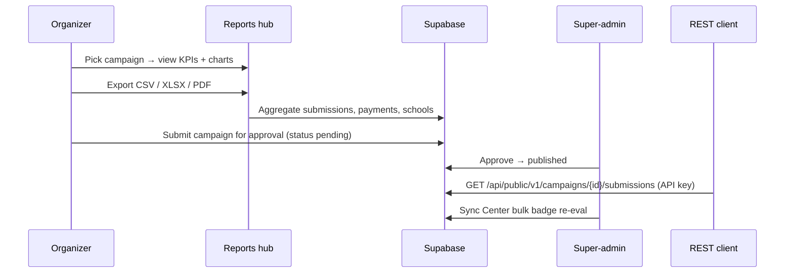

# Phase E — Business Tools & Admin Implementation Plan

> **For agentic workers:** REQUIRED SUB-SKILL: Use superpowers:subagent-driven-development (recommended) or superpowers:executing-plans to implement this plan task-by-task. Steps use checkbox (`- [ ]`) syntax for tracking.
>
> **Implementation style:** Same as Phase B/C/D — implement **inline** in one session (no subagents unless the user asks). Run `npm run type-check` + `npm run build` before marking done.

**Goal:** Replace the reports `ComingSoon` stub with a real organizer reports hub (CSV/XLSX/PDF exports + time-series charts), add admin campaign approval, user role/admin promotion, campaign ownership transfer, campaign JSON import/export (schema v1), a public REST API for submissions/KPIs with API-key auth, centralized audit logging, and a Sync Center for bulk maintenance jobs.

**Architecture:** Reports read from Supabase via organizer-scoped RLS (campaigns owned by the signed-in organizer). Export routes stream files from server-side aggregations — reuse the hand-rolled CSV pattern from Phase C school exports and Phase B wallet export. XLSX uses `exceljs` (multi-sheet workbooks). PDF reports use `pdf-lib` (already installed for certificates) with a simple table layout. Charts use `recharts` (client components, dynamic import) for participant/revenue time series. Campaign approval gates publish: when `platform_settings.require_campaign_approval` is true, organizer “Publish” sets `status: pending`; super-admin approves at `/dashboard/admin/campaigns`. REST API lives under `/api/public/v1/…` with Bearer API keys stored hashed in `api_keys` (middleware already bypasses session auth for `/api/public/`). Audit writes go through `writeAuditLog()` called from server actions.

**Tech stack:** Next.js 15 App Router, Supabase Postgres + RLS, `exceljs`, `recharts`, `pdf-lib`, `zod` (import schema validation), existing `audit_log` table.

**Plugin reference files:** `includes/business/class-cw-business-reports.php`, `includes/business/class-cw-report-export.php`, `includes/dashboard/class-cw-dashboard-business.php`

**Depends on:** Phases A–D (campaign editor, submissions, payments, schools, badges, certificates).

**Current state (~5% done):** `/dashboard/reports` is `ComingSoon`; organizer dashboard has basic stat cards; admin hub has read-only users list, moderation links, audit log tail; selective `audit_log` writes in payment/badge/email paths; scoped CSV exports exist for schools/wallet but not full judging roster; no XLSX/PDF/charts; no `pending` campaign workflow; no REST API routes; no Sync Center UI.

---

## End-to-end flows



---

## Phase E checklist mapping (12 items)

| # | Checklist item | Task(s) |
|---|----------------|---------|
| 1 | Reports dashboard (replace `ComingSoon` stub) | 3, 4 |
| 2 | Export CSV roster | 5 |
| 3 | Export XLSX (multi-sheet) | 6 |
| 4 | Export PDF report | 7 |
| 5 | Revenue / participant time-series charts | 4 |
| 6 | Campaign JSON import (schema v1) | 8 |
| 7 | Admin campaign approval queue (`pending` → `published`) | 9 |
| 8 | Admin user role / `is_admin` promote UI | 10 |
| 9 | Campaign ownership transfer (admin) | 11 |
| 10 | REST API: `/campaigns/{id}/submissions`, `/kpis`, webhook auth | 12 |
| 11 | Audit log writes from app actions | 2, 13 |
| 12 | Sync Center equivalents (badge re-eval, token sync, coupon sync) | 14 |

---

## File map

| File | Responsibility |
|------|----------------|
| `supabase/migrations/20260704120000_phase_e_business.sql` | `platform_settings`, `api_keys`, optional `campaign_exports` metadata |
| `src/lib/audit/log.ts` | `writeAuditLog()` helper |
| `src/lib/reports/aggregate.ts` | KPI + time-series queries per campaign |
| `src/lib/reports/csv-roster.ts` | Judging roster CSV builder |
| `src/lib/reports/export-xlsx.ts` | Multi-sheet workbook (Summary, Submissions, Schools, Revenue) |
| `src/lib/reports/export-pdf.ts` | PDF report via pdf-lib |
| `src/lib/campaigns/import-schema.ts` | Zod schema for campaign import v1 |
| `src/lib/campaigns/import-json.ts` | Parse + insert campaign + children |
| `src/lib/campaigns/export-json.ts` | Export campaign + children as JSON v1 |
| `src/lib/api/validate-api-key.ts` | Hash lookup, scope check, organizer scope |
| `src/app/dashboard/reports/page.tsx` | **Rewrite** — campaign picker, KPIs, charts, export buttons |
| `src/components/reports/reports-dashboard.tsx` | Client charts (recharts) |
| `src/components/reports/campaign-report-picker.tsx` | Campaign select + date range |
| `src/app/dashboard/reports/export/[campaignId]/roster/route.ts` | CSV roster download |
| `src/app/dashboard/reports/export/[campaignId]/xlsx/route.ts` | XLSX download |
| `src/app/dashboard/reports/export/[campaignId]/pdf/route.ts` | PDF download |
| `src/app/dashboard/admin/campaigns/page.tsx` | Pending approval queue |
| `src/app/dashboard/admin/campaigns/actions.ts` | Approve / reject pending campaigns |
| `src/app/dashboard/admin/users/actions.ts` | Promote admin, change role |
| `src/app/dashboard/admin/users/page.tsx` | **Extend** — action forms per user |
| `src/app/dashboard/admin/transfer/actions.ts` | Campaign ownership transfer |
| `src/app/dashboard/admin/sync/page.tsx` | Sync Center UI |
| `src/app/dashboard/admin/sync/actions.ts` | Bulk badge re-eval, coupon sync, token regen |
| `src/app/dashboard/admin/api-keys/page.tsx` | Organizer API key management (admin creates for org) |
| `src/app/api/public/v1/campaigns/[id]/submissions/route.ts` | REST submissions list |
| `src/app/api/public/v1/campaigns/[id]/kpis/route.ts` | REST KPI summary |
| `src/app/dashboard/campaigns/actions.ts` | **Modify** — publish → `pending` when approval required |
| `src/app/dashboard/campaigns/[id]/page.tsx` | **Modify** — “Submit for review” copy when gated |
| `src/app/dashboard/campaigns/import/page.tsx` | JSON import UI |
| `src/app/dashboard/campaigns/import/actions.ts` | Import server action |
| `src/components/dashboard/dashboard-shell.tsx` | Admin nav: Campaigns, Sync, API keys |
| `src/lib/supabase/database.types.ts` | New tables/columns |
| `docs/MIGRATION-CHECKLIST.md` | Tick Phase E when done |

---

## Schema additions (migration)

```sql
-- Platform-wide toggles (singleton)
create table if not exists public.platform_settings (
  id                          text primary key default 'default',
  require_campaign_approval   boolean not null default false,
  updated_at                  timestamptz not null default now(),
  updated_by                  uuid references public.profiles(id)
);

insert into public.platform_settings (id, require_campaign_approval)
values ('default', false)
on conflict (id) do nothing;

-- API keys for REST / webhook integrations (organizer-scoped)
do $$ begin
  create type cw_api_key_scope as enum ('read_submissions', 'read_kpis', 'webhooks');
exception when duplicate_object then null; end $$;

create table if not exists public.api_keys (
  id              uuid primary key default gen_random_uuid(),
  organizer_id    uuid not null references public.organizers(id) on delete cascade,
  name            text not null,
  key_prefix      text not null,          -- first 8 chars for display e.g. cw_live_Ab
  key_hash        text not null unique,   -- sha256 of full secret
  scopes          cw_api_key_scope[] not null default '{read_submissions,read_kpis}',
  is_active       boolean not null default true,
  last_used_at    timestamptz,
  created_at      timestamptz not null default now(),
  created_by      uuid references public.profiles(id)
);

create index if not exists api_keys_organizer_idx on public.api_keys(organizer_id);
create index if not exists api_keys_prefix_idx on public.api_keys(key_prefix);

alter table public.api_keys enable row level security;

-- Organizers see own keys; admins see all
create policy api_keys_organizer_select on public.api_keys
  for select using (
    exists (
      select 1 from public.organizers o
      where o.id = organizer_id and o.owner_id = auth.uid()
    )
  );

create policy api_keys_admin_all on public.api_keys
  for all using (public.is_admin()) with check (public.is_admin());

-- Service role inserts/validates for REST routes (no client INSERT policy for organizers via anon)
```

**Note:** REST route handlers use `createAdminClient()` for key validation and data reads after scope check — keys never stored in plaintext after creation (show-once pattern).

---

## Campaign JSON import schema v1

```typescript
// src/lib/campaigns/import-schema.ts
const CampaignImportV1 = z.object({
  schema_version: z.literal(1),
  campaign: z.object({
    title: z.string().min(1),
    type: z.enum(["competition", "activity", "workshop"]),
    slug: z.string().optional(),
    // ... core fields matching campaigns table (no id, organizer_id, status)
  }),
  prizes: z.array(z.object({ title: z.string(), description: z.string().nullable().optional(), sort_order: z.number() })).default([]),
  faq_items: z.array(z.object({ question: z.string(), answer: z.string(), sort_order: z.number() })).default([]),
  age_brackets: z.array(z.object({ key: z.string(), label: z.string(), min_age: z.number(), max_age: z.number(), sort_order: z.number() })).default([]),
  custom_fields: z.array(z.object({ label: z.string(), field_type: z.string(), options: z.string().nullable().optional(), required: z.boolean(), sort_order: z.number() })).default([]),
});
```

Import creates campaign as `draft`. Export from existing campaign produces the same shape for round-trip.

---

## REST API surface

| Method | Path | Scope | Response |
|--------|------|-------|----------|
| `GET` | `/api/public/v1/campaigns/{id}/submissions` | `read_submissions` | Paginated submission roster (code, name, status, score, rank, paid_at) |
| `GET` | `/api/public/v1/campaigns/{id}/kpis` | `read_kpis` | `{ submissions_count, paid_count, revenue_total, vote_total, by_status, by_day }` |

**Auth:** `Authorization: Bearer <secret>` where secret was shown once at key creation. Validate:

```typescript
export async function validateApiKey(request: Request, requiredScope: CwApiKeyScope) {
  const auth = request.headers.get("authorization") ?? "";
  const token = auth.replace(/^Bearer\s+/i, "").trim();
  if (!token) return null;
  const hash = createHash("sha256").update(token).digest("hex");
  // lookup api_keys by key_hash, check is_active + scopes includes requiredScope
  // return { organizerId, keyId }
}
```

**Authorization:** Campaign must belong to the key's `organizer_id`.

---

## Task 1: Database migration + types

**Files:**
- Create: `supabase/migrations/20260704120000_phase_e_business.sql`
- Modify: `src/lib/supabase/database.types.ts`

- [ ] **Step 1: Write migration** (SQL above)

- [ ] **Step 2: Hand-update types** — `PlatformSettingsRow`, `ApiKeyRow`, `CWApiKeyScope`

- [ ] **Step 3: Apply migration** — `supabase db push`

- [ ] **Step 4: Commit**

---

## Task 2: Centralized audit logging

**Files:**
- Create: `src/lib/audit/log.ts`

- [ ] **Step 1: Helper**

```typescript
export async function writeAuditLog(opts: {
  action: string;
  objectType: string;
  objectId?: string | null;
  actorId?: string | null;
  details?: Record<string, unknown>;
}) {
  const supabase = createAdminClient();
  await supabase.from("audit_log").insert({
    action: opts.action,
    object_type: opts.objectType,
    object_id: opts.objectId ?? null,
    actor_id: opts.actorId ?? null,
    details: opts.details ?? null,
  });
}
```

- [ ] **Step 2: Refactor existing ad-hoc inserts** in payment/badge/email files to use helper (optional thin wrapper — don't break behavior)

- [ ] **Step 3: Commit**

---

## Task 3: Reports aggregation library

**Files:**
- Create: `src/lib/reports/aggregate.ts`

- [ ] **Step 1: `getCampaignReport(campaignId, organizerId)`** — verify ownership, return:

```typescript
type CampaignReport = {
  campaign: { id, title, slug, status, kpi_target, submissions_count, entry_fee, currency };
  totals: {
    submissions: number;
    paid: number;
    staged: number;
    shortlisted: number;
    winners: number;
    revenue: number;       // sum payment_orders.amount_cents where status=paid / 100
    votes: number;         // sum submissions.vote_count
  };
  byStatus: { status: string; count: number }[];
  byAgeBracket: { label: string; count: number }[];
  bySchool: { school_name: string; count: number }[];
  participantsByDay: { date: string; count: number }[];  // submissions.created_at::date
  revenueByDay: { date: string; amount: number }[];      // payment_orders.paid_at::date
};
```

- [ ] **Step 2: Use admin client only after ownership check via organizer RLS client

- [ ] **Step 3: Commit**

---

## Task 4: Reports dashboard UI + charts

**Files:**
- Rewrite: `src/app/dashboard/reports/page.tsx`
- Create: `src/components/reports/campaign-report-picker.tsx`
- Create: `src/components/reports/reports-dashboard.tsx` (client, recharts)

- [ ] **Step 1: Install deps**

```bash
npm install recharts exceljs
npm install -D @types/recharts
```

- [ ] **Step 2: Page** — organizer selects campaign (dropdown of owned campaigns); default to most recent published

- [ ] **Step 3: KPI cards** — submissions, paid, revenue, KPI progress %, votes

- [ ] **Step 4: Charts** (client component, `"use client"`):
  - Line chart: participants by day
  - Line/bar chart: revenue by day
  - Donut/pie: submissions by status

- [ ] **Step 5: Export button row** — links to Task 5–7 routes

- [ ] **Step 6: Commit**

---

## Task 5: CSV roster export

**Files:**
- Create: `src/lib/reports/csv-roster.ts`
- Create: `src/app/dashboard/reports/export/[campaignId]/roster/route.ts`

- [ ] **Step 1: Columns** — `submission_code`, `student_name`, `status`, `moderation_status`, `score`, `rank`, `vote_count`, `age_bracket`, `school_name`, `guardian_name`, `guardian_contact`, `paid_at`, `created_at`

- [ ] **Step 2: Include staged rows when `enable_school_sponsors` (checkbox query param `?include_staged=1`)

- [ ] **Step 3: Route** — auth organizer + owns campaign; `Content-Disposition: attachment`

- [ ] **Step 4: Commit**

---

## Task 6: XLSX multi-sheet export

**Files:**
- Create: `src/lib/reports/export-xlsx.ts`
- Create: `src/app/dashboard/reports/export/[campaignId]/xlsx/route.ts`

- [ ] **Step 1: Workbook sheets**
  1. **Summary** — campaign meta + KPI totals from `getCampaignReport`
  2. **Submissions** — full roster (same as CSV)
  3. **Schools** — school_code, name, submission count, coupon code
  4. **Revenue** — payment_orders rows (reference, amount, paid_at, status)

- [ ] **Step 2: Stream buffer response `application/vnd.openxmlformats-officedocument.spreadsheetml.sheet`

- [ ] **Step 3: Commit**

---

## Task 7: PDF report export

**Files:**
- Create: `src/lib/reports/export-pdf.ts`
- Create: `src/app/dashboard/reports/export/[campaignId]/pdf/route.ts`

- [ ] **Step 1: PDF layout** (pdf-lib, A4 portrait):
  - Header: campaign title, generated date
  - Summary table: KPI totals
  - Top 20 submissions table (name, code, status, score, votes) — truncate if more

- [ ] **Step 2: Route returns `application/pdf`

- [ ] **Step 3: Commit**

---

## Task 8: Campaign JSON import + export

**Files:**
- Create: `src/lib/campaigns/import-schema.ts`
- Create: `src/lib/campaigns/import-json.ts`
- Create: `src/lib/campaigns/export-json.ts`
- Create: `src/app/dashboard/campaigns/import/page.tsx`
- Create: `src/app/dashboard/campaigns/import/actions.ts`
- Modify: `src/app/dashboard/campaigns/page.tsx` — Import + Export buttons

- [ ] **Step 1: Zod validate upload** — reject unknown `schema_version`

- [ ] **Step 2: Import** — create `draft` campaign + sync children via existing `syncCampaignChildren` pattern

- [ ] **Step 3: Export** — `GET /dashboard/campaigns/[id]/export/json` route or server action download

- [ ] **Step 4: `writeAuditLog({ action: 'campaign.imported' | 'campaign.exported', ... })`

- [ ] **Step 5: Commit**

---

## Task 9: Admin campaign approval queue

**Files:**
- Create: `src/app/dashboard/admin/campaigns/page.tsx`
- Create: `src/app/dashboard/admin/campaigns/actions.ts`
- Modify: `src/app/dashboard/campaigns/actions.ts` — `setCampaignStatusAction`
- Modify: `src/app/dashboard/campaigns/[id]/page.tsx`
- Modify: `src/app/dashboard/admin/payments/` pattern for `platform_settings` toggle (or add to admin overview)

- [ ] **Step 1: Platform toggle** — super-admin can enable `require_campaign_approval` on `/dashboard/admin/settings` or payments-adjacent card

- [ ] **Step 2: Organizer publish flow**

```typescript
// setCampaignStatusAction when status === 'published'
const settings = await getPlatformSettings();
const nextStatus = settings.require_campaign_approval ? 'pending' : 'published';
```

- [ ] **Step 3: Admin queue** — list `campaigns.status = 'pending'` with organizer name; Approve → `published` + `published_at`; Reject → `draft` + optional note in audit log

- [ ] **Step 4: Campaign detail UI** — show “Awaiting admin approval” badge when `pending`

- [ ] **Step 5: `writeAuditLog` on approve/reject/submit

- [ ] **Step 6: Commit**

---

## Task 10: Admin user role + `is_admin` promotion

**Files:**
- Create: `src/app/dashboard/admin/users/actions.ts`
- Modify: `src/app/dashboard/admin/users/page.tsx`

- [ ] **Step 1: Actions** (admin only via `createAdminClient`):
  - `setUserRoleAction(userId, role)` — `contestant` | `creator` | `organizer`
  - `setUserAdminAction(userId, isAdmin: boolean)`

- [ ] **Step 2: UI** — per-user row: role `<Select>` + Grant/Revoke admin button

- [ ] **Step 3: Guardrails** — cannot demote self from admin; audit log each change

- [ ] **Step 4: Commit**

---

## Task 11: Campaign ownership transfer (admin)

**Files:**
- Create: `src/app/dashboard/admin/transfer/actions.ts`
- Extend: `src/app/dashboard/admin/campaigns/page.tsx` — transfer form on each row

- [ ] **Step 1: `transferCampaignAction(campaignId, newOrganizerId)`**
  - Verify admin
  - Update `campaigns.organizer_id`
  - `writeAuditLog({ action: 'campaign.transferred', details: { from, to } })`

- [ ] **Step 2: UI** — dropdown of organizers (search by name/email)

- [ ] **Step 3: Commit**

---

## Task 12: REST API + API key management

**Files:**
- Create: `src/lib/api/validate-api-key.ts`
- Create: `src/app/api/public/v1/campaigns/[id]/submissions/route.ts`
- Create: `src/app/api/public/v1/campaigns/[id]/kpis/route.ts`
- Create: `src/app/dashboard/admin/api-keys/page.tsx` (or organizer settings if preferred)
- Create: `src/app/dashboard/admin/api-keys/actions.ts`

- [ ] **Step 1: Key generation** — `cw_live_` + 32 random bytes hex; store sha256 hash; show secret once

- [ ] **Step 2: Submissions endpoint** — paginate `?page=1&limit=50`; filter `?status=paid`

- [ ] **Step 3: KPIs endpoint** — return `getCampaignReport` totals subset as JSON

- [ ] **Step 4: Update `last_used_at` on successful auth

- [ ] **Step 5: Rate limit** — simple in-memory or comment header `X-RateLimit-Remaining` (optional; document as follow-up if skipped)

- [ ] **Step 6: Commit**

---

## Task 13: Wire audit log across app actions

**Files:**
- Modify: `src/app/dashboard/campaigns/actions.ts`
- Modify: `src/app/dashboard/campaigns/[id]/submissions/actions.ts`
- Modify: `src/app/dashboard/admin/withdrawals/` (if exists)
- Modify: `src/app/dashboard/campaigns/import/actions.ts`
- Modify: export routes (log `report.exported`)

- [ ] **Step 1: Add `writeAuditLog` calls for:**
  - `campaign.published` / `campaign.pending_submitted` / `campaign.closed`
  - `submission.review_saved` / `submission.status_changed`
  - `user.role_changed` / `user.admin_granted` / `user.admin_revoked`
  - `campaign.transferred` / `campaign.imported`
  - `report.exported` (csv/xlsx/pdf)
  - `api_key.created` / `api_key.revoked`
  - `sync.badge_reeval` / `sync.coupons` / `sync.tokens`

- [ ] **Step 2: Commit**

---

## Task 14: Sync Center + integration verification

**Files:**
- Create: `src/app/dashboard/admin/sync/page.tsx`
- Create: `src/app/dashboard/admin/sync/actions.ts`
- Modify: `src/app/dashboard/admin/page.tsx` — Sync Center card
- Modify: `src/components/dashboard/dashboard-shell.tsx` — admin nav links

- [ ] **Step 1: Sync actions**
  - **Badge re-eval all** — paginate `profiles` ids, call `evaluateBadgesForUser` (batch 50, show progress count)
  - **Coupon sync** — for campaign picker: re-run `syncSchoolCoupon` for each school with `coupon_code`
  - **Token regen** — optional: extend expiry on all upload_tokens for a campaign (+90 days) OR document as “regenerate missing” only

- [ ] **Step 2: UI** — three cards with campaign selector where needed + Run button + last-run summary from audit log

- [ ] **Step 3: Type-check** — `npm run type-check` → PASS

- [ ] **Step 4: Build** — `npm run build` → PASS

- [ ] **Step 5: Smoke test matrix**

| # | Flow | Expected |
|---|------|----------|
| 1 | Open `/dashboard/reports` | Campaign picker, KPIs, charts load |
| 2 | Export CSV roster | Valid CSV downloads |
| 3 | Export XLSX | 4-sheet workbook opens in Excel |
| 4 | Export PDF | PDF with summary + table |
| 5 | Import campaign JSON v1 | Draft campaign + children created |
| 6 | Enable approval → organizer publishes | Status `pending` |
| 7 | Admin approves campaign | Status `published`, public page live |
| 8 | Admin promotes user to organizer | Role updated |
| 9 | Admin transfers campaign | `organizer_id` changes |
| 10 | REST GET submissions with API key | JSON 200; wrong key 401 |
| 11 | Sync badge re-eval | Audit log entry; new badges awarded |
| 12 | Audit log on admin page | New events visible |

- [ ] **Step 6: Mark Phase E `[x]` in `docs/MIGRATION-CHECKLIST.md`

- [ ] **Step 7: Commit**

---

## Out of scope (Phase E boundaries)

Do **not** build in Phase E:

- Phase F design mockup / print compositor
- Full business application + organizer onboarding approval (checklist §1 — separate from campaign approval)
- Contact form backend, newsletter signup
- Public submissions gallery toggle
- Saved campaigns / bookmarks
- Rate limiting on registration
- Webhook **delivery** outbound (only API key auth for inbound REST; outbound webhooks are future)
- Full plugin 5-step campaign wizard UX
- PDPA user data export (`data_export_requests`) — already exists separately

---

## Security checklist

- [ ] Export routes verify organizer owns campaign (or admin)
- [ ] API keys stored as hashes only; secret shown once at creation
- [ ] REST endpoints verify campaign belongs to key's organizer
- [ ] Admin actions require `is_admin` (server-side, not UI-only)
- [ ] Cannot revoke own admin without another admin
- [ ] Campaign transfer logged with actor + before/after organizer ids
- [ ] JSON import validated with Zod; reject path traversal in slug
- [ ] `/api/public/*` does not expose PII beyond what organizer already owns (guardian fields optional in API response flag)

---

## Environment

| Variable | Purpose |
|----------|---------|
| `SUPABASE_SERVICE_ROLE_KEY` | API key validation, audit log, sync bulk jobs |
| Existing Supabase URL/anon key | Organizer-scoped reads |

---

## Self-review (spec coverage)

All 12 Phase E checklist items mapped in the table at the top. No placeholder steps.

---

## Changelog

| Date | Change |
|------|--------|
| 2026-07-01 | Phase E plan — business reports, admin tools, REST API |
