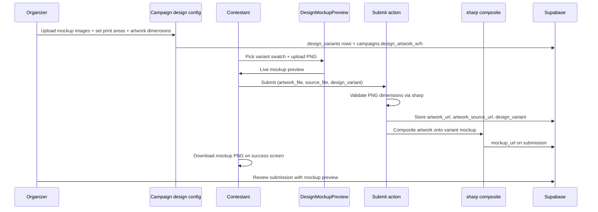

# Phase F — Design Submission (Print-on-Product) Implementation Plan

> **For agentic workers:** REQUIRED SUB-SKILL: Use superpowers:subagent-driven-development (recommended) or superpowers:executing-plans to implement this plan task-by-task. Steps use checkbox (`- [ ]`) syntax for tracking.
>
> **Implementation style:** Same as Phases B–E — implement **inline** in one session (no subagents unless the user asks). Run `npm run type-check` + `npm run build` before marking done.

**Goal:** Deliver the full print-on-product design submission flow: organizers configure product variants (mockup image + print area + required artwork dimensions), contestants upload dimension-validated PNG artwork plus optional vector/source files, pick a variant via swatches, preview artwork composited on the product mockup at submit time, persist a server-generated mockup PNG, and let contestants download the mockup post-submission while organizers see the composite in review.

**Architecture:** Campaign-level design settings already exist on `campaigns` (`enable_design`, `design_picker_label`, `design_artwork_w`, `design_artwork_h`). Add a `design_variants` child table (one row per product color/size with mockup base image URL and print-area rectangle as percentages). Submissions already have `artwork_url`, `artwork_source_url`, `design_variant`; add `mockup_url` for the persisted composite. **Live preview** uses a client Canvas compositor (`DesignMockupPreview`) — same role as the WordPress plugin’s `cw-design-preview.js`. **Final mockup** is generated server-side with `sharp` (already installed for certificates) so downloads are reliable and not dependent on client canvas export quality. Wire into all three upload surfaces: public `/campaigns/[slug]/submit`, school PIC portal `/cw-school-upload/[token]`, and organizer review at `/dashboard/campaigns/[id]/submissions/[subId]`. When `enable_design` is false, existing generic artwork upload behavior is unchanged.

**Tech stack:** Next.js 15 App Router, Supabase Postgres + RLS + Storage (`artworks`, `banners` buckets), HTML Canvas (client preview), `sharp` (server composite), `zod` (variant validation), existing `uploadPublicFile` helper.

**Plugin reference:** `cw-design-preview.js` (canvas overlay of artwork onto product casing image inside print area)

**Depends on:** Phases A–E (campaign editor, submissions, payments, school upload, reports). Certificate generation already uses `sharp` — reuse patterns from `src/lib/certificates/generate.ts`.

**Current state (~15% done):** `enable_design` toggle saves on campaign form; submit/school-upload require artwork when design mode is on but accept any image/PDF with no dimension check, no variant picker, no compositor, no source-file field, no `mockup_url`, no organizer design config UI. DB columns `design_variant`, `artwork_source_url` exist but are never written.

---

## End-to-end flows



---

## Phase F checklist mapping (7 items)

| # | Checklist item | Task(s) |
|---|----------------|---------|
| 1 | Campaign design mode config (variants, print area, dimensions) | 1, 3, 4 |
| 2 | Design artwork PNG upload with dimension validation | 5, 7, 8 |
| 3 | Source file upload (.ai, .pdf, .svg, .eps) | 5, 7, 8 |
| 4 | Canvas mockup compositor at checkout/submit | 6, 7, 8 |
| 5 | Variant picker (color/size swatches) | 3, 6, 7, 8 |
| 6 | Download mockup PNG post-submission | 7, 8, 9 |
| 7 | Design preview in organizer review UI | 10 |

---

## File map

| File | Responsibility |
|------|----------------|
| `supabase/migrations/20260705120000_phase_f_design.sql` | `design_variants` table, `submissions.mockup_url`, RLS, optional `mockups` storage bucket |
| `src/lib/supabase/database.types.ts` | `DesignVariantRow`, `mockup_url` on `SubmissionRow` |
| `src/lib/design/validate-artwork.ts` | PNG dimension check via `sharp`; client-side pre-check helper |
| `src/lib/design/source-mime.ts` | Allowed source MIME map (.ai/.pdf/.svg/.eps) |
| `src/lib/design/composite-mockup.ts` | Server `sharp` composite: base mockup + artwork in print area → PNG buffer |
| `src/lib/design/load-variant.ts` | Fetch variant by campaign + slug |
| `src/lib/design/sync-variants.ts` | Replace `design_variants` rows (mirror `syncCampaignChildren`) |
| `src/components/design/design-mockup-preview.tsx` | Client canvas compositor + variant swatch picker |
| `src/components/design/design-upload-panel.tsx` | Artwork PNG + source file inputs wired to preview |
| `src/components/campaigns/design-config-panel.tsx` | Organizer repeater: variants, mockup upload, print area, dimensions |
| `src/app/dashboard/campaigns/design-actions.ts` | Save design settings + sync variants + upload mockup images |
| `src/components/campaigns/campaign-form.tsx` | **Modify** — show `design_picker_label`, `design_artwork_w/h` when `enable_design` |
| `src/app/dashboard/campaigns/[id]/page.tsx` | **Modify** — render `DesignConfigPanel` when `enable_design` |
| `src/app/(public)/campaigns/[slug]/submit/submit-entry-form.tsx` | **Modify** — swap artwork card for `DesignUploadPanel` when design mode |
| `src/app/(public)/campaigns/[slug]/submit/actions.ts` | **Modify** — validate dimensions, source upload, composite mockup |
| `src/app/(public)/campaigns/[slug]/submit/page.tsx` | **Modify** — pass variants + design settings to form |
| `src/app/(public)/cw-school-upload/[token]/upload-form.tsx` | **Modify** — design panel when enabled |
| `src/app/(public)/cw-school-upload/[token]/actions.ts` | **Modify** — same design pipeline as public submit |
| `src/app/(public)/cw-school-upload/[token]/page.tsx` | **Modify** — load variants for token context |
| `src/lib/schools/validate-upload-token.ts` | **Modify** — include design fields in campaign select |
| `src/app/api/mockups/[submissionId]/download/route.ts` | Authenticated mockup PNG download |
| `src/app/dashboard/campaigns/[id]/submissions/[subId]/page.tsx` | **Modify** — mockup + source file preview |
| `src/lib/campaigns/import-schema.ts` | **Modify** — `design_variants` array in v1 export/import |
| `src/lib/campaigns/export-json.ts` | **Modify** — include variants |
| `src/lib/campaigns/import-json.ts` | **Modify** — insert variants on import |
| `src/lib/storage/upload.ts` | **Modify** — `SOURCE_MIME_TYPES`, `validatePngDimensions()` |
| `docs/MIGRATION-CHECKLIST.md` | Tick Phase F when done |

---

## Schema additions (migration)

```sql
-- Product mockup variants per campaign (phone case colors, sizes, etc.)
create table if not exists public.design_variants (
  id              uuid primary key default gen_random_uuid(),
  campaign_id     uuid not null references public.campaigns(id) on delete cascade,
  slug            text not null,
  label           text not null,
  swatch_color    text,                    -- hex e.g. #1a1a1a for color picker UI
  size_label      text,                    -- optional e.g. "iPhone 15 Pro"
  mockup_image_url text not null,          -- product casing base image (PNG/JPG)
  print_area_x    numeric(6,2) not null default 0,   -- % of mockup width (0–100)
  print_area_y    numeric(6,2) not null default 0,
  print_area_w    numeric(6,2) not null default 100,
  print_area_h    numeric(6,2) not null default 100,
  sort_order      integer not null default 0,
  is_active       boolean not null default true,
  created_at      timestamptz not null default now(),
  unique (campaign_id, slug)
);

create index if not exists design_variants_campaign_idx on public.design_variants(campaign_id);

alter table public.design_variants enable row level security;

-- Public read for published campaigns; organizers CRUD own campaigns
create policy design_variants_public_read on public.design_variants
  for select using (
    exists (
      select 1 from public.campaigns c
      where c.id = campaign_id and c.status = 'published'
    )
  );

create policy design_variants_organizer_all on public.design_variants
  for all using (
    exists (
      select 1 from public.campaigns c
      join public.organizers o on o.id = c.organizer_id
      where c.id = campaign_id and o.owner_id = auth.uid()
    )
  ) with check (
    exists (
      select 1 from public.campaigns c
      join public.organizers o on o.id = c.organizer_id
      where c.id = campaign_id and o.owner_id = auth.uid()
    )
  );

-- Persisted composite mockup PNG per submission
alter table public.submissions
  add column if not exists mockup_url text;

-- Optional dedicated bucket (or reuse artworks/mockups/ prefix)
insert into storage.buckets (id, name, public)
values ('mockups', 'mockups', true)
on conflict (id) do nothing;
```

**Print area model:** Coordinates are **percentages** of the mockup image dimensions (matches typical plugin crop UI). Example phone case: `print_area_x=22, print_area_y=18, print_area_w=56, print_area_h=64`.

**Default artwork dimensions:** When organizer sets `design_artwork_w=2000, design_artwork_h=2000`, server rejects PNGs whose pixel size differs (exact match) or allows ±0 tolerance — start strict (exact) to match print shop expectations; document in UI.

---

## Design variant shape (TypeScript)

```typescript
export interface DesignVariantRow {
  id: string;
  campaign_id: string;
  slug: string;
  label: string;
  swatch_color: string | null;
  size_label: string | null;
  mockup_image_url: string;
  print_area_x: number;
  print_area_y: number;
  print_area_w: number;
  print_area_h: number;
  sort_order: number;
  is_active: boolean;
  created_at: string;
}

export type DesignVariantInput = {
  slug: string;
  label: string;
  swatch_color?: string | null;
  size_label?: string | null;
  mockup_image_url: string;
  print_area_x: number;
  print_area_y: number;
  print_area_w: number;
  print_area_h: number;
  sort_order: number;
  is_active?: boolean;
};
```

---

## Compositor behavior (client + server)

### Client preview (`DesignMockupPreview`)

```typescript
// Pseudocode — implement in design-mockup-preview.tsx
// 1. Load selected variant.mockup_image_url into Image()
// 2. Load user artwork File/Blob into Image()
// 3. canvas.width = mockup.naturalWidth; canvas.height = mockup.naturalHeight
// 4. ctx.drawImage(mockup, 0, 0)
// 5. Compute pixel rect from percentages:
//    const x = (print_area_x / 100) * w
//    const y = (print_area_y / 100) * h
//    const pw = (print_area_w / 100) * w
//    const ph = (print_area_h / 100) * h
// 6. ctx.drawImage(artwork, x, y, pw, ph)  // cover or contain — use 'contain' first
// 7. Expose canvas ref for optional client export; server is source of truth
```

### Server composite (`compositeMockup`)

```typescript
import sharp from "sharp";

export async function compositeMockup(opts: {
  mockupUrl: string;
  artworkBuffer: Buffer;
  printArea: { x: number; y: number; w: number; h: number }; // percentages
}): Promise<Buffer> {
  const mockupRes = await fetch(opts.mockupUrl);
  const mockupBuf = Buffer.from(await mockupRes.arrayBuffer());
  const mockup = sharp(mockupBuf);
  const meta = await mockup.metadata();
  const W = meta.width ?? 1;
  const H = meta.height ?? 1;

  const left = Math.round((opts.printArea.x / 100) * W);
  const top = Math.round((opts.printArea.y / 100) * H);
  const width = Math.round((opts.printArea.w / 100) * W);
  const height = Math.round((opts.printArea.h / 100) * H);

  const artworkResized = await sharp(opts.artworkBuffer)
    .resize(width, height, { fit: "contain", background: { r: 0, g: 0, b: 0, alpha: 0 } })
    .png()
    .toBuffer();

  return mockup
    .composite([{ input: artworkResized, left, top }])
    .png()
    .toBuffer();
}
```

After composite, upload to `mockups/{campaignId}/{submissionId}.png` via admin client (school upload uses admin client already).

---

## Source file MIME allowlist

```typescript
export const SOURCE_MIME_TYPES = [
  "application/pdf",
  "image/svg+xml",
  "application/postscript",           // .eps / some .ai
  "application/illustrator",
  "application/octet-stream",         // fallback for .ai uploads from some browsers
] as const;

export const SOURCE_EXTENSIONS = [".pdf", ".svg", ".eps", ".ai"] as const;
```

Validate extension **and** MIME; max size 25 MB (larger than raster cap). Store at `artworks/{campaignId}/sources/{uuid}{ext}` — public URL OK (UUID obscurity); organizer review links directly.

---

## Task 1: Database migration + types

**Files:**
- Create: `supabase/migrations/20260705120000_phase_f_design.sql`
- Modify: `src/lib/supabase/database.types.ts`

- [ ] **Step 1: Write migration** (SQL above + storage policies for `mockups` bucket mirroring `artworks` public-read pattern)

- [ ] **Step 2: Hand-update types** — `DesignVariantRow`, `design_variants` table entry, `mockup_url` on `SubmissionRow`

- [ ] **Step 3: Apply migration** — `supabase db push`

- [ ] **Step 4: Commit**

---

## Task 2: Design validation + upload helpers

**Files:**
- Create: `src/lib/design/validate-artwork.ts`
- Create: `src/lib/design/source-mime.ts`
- Modify: `src/lib/storage/upload.ts`

- [ ] **Step 1: `validatePngDimensions(file, expectedW, expectedH)`**

```typescript
import sharp from "sharp";

export async function validatePngDimensions(
  buffer: Buffer,
  expectedW: number | null,
  expectedH: number | null,
): Promise<{ ok: true } | { ok: false; message: string }> {
  if (!expectedW || !expectedH) return { ok: true };
  const meta = await sharp(buffer).metadata();
  if (meta.width !== expectedW || meta.height !== expectedH) {
    return {
      ok: false,
      message: `Artwork must be exactly ${expectedW}×${expectedH}px (got ${meta.width}×${meta.height}).`,
    };
  }
  return { ok: true };
}
```

- [ ] **Step 2: Client pre-check** — `readImageDimensions(file: File): Promise<{w,h}>` using `createImageBitmap` or `Image` + object URL for instant form feedback before submit

- [ ] **Step 3: `uploadSourceFile()`** — uses `SOURCE_MIME_TYPES`, 25 MB cap, path under `sources/`

- [ ] **Step 4: Restrict design-mode artwork to PNG only** — `PNG_MIME = ["image/png"]` when `enable_design`; keep existing JPEG/webp for non-design campaigns

- [ ] **Step 5: Commit**

---

## Task 3: Organizer design config UI

**Files:**
- Create: `src/lib/design/sync-variants.ts`
- Create: `src/app/dashboard/campaigns/design-actions.ts`
- Create: `src/components/campaigns/design-config-panel.tsx`
- Modify: `src/components/campaigns/campaign-form.tsx`
- Modify: `src/app/dashboard/campaigns/[id]/page.tsx`

- [ ] **Step 1: Campaign form fields** (visible when `enable_design` checked via small client wrapper or conditional section):
  - `design_picker_label` (default: "Choose your product")
  - `design_artwork_w` / `design_artwork_h` (required when design on)

- [ ] **Step 2: `DesignConfigPanel`** — repeater rows per variant:
  - Label, slug (auto from label), swatch color (`<input type="color">`), size label
  - Mockup image upload → `banners` or `artworks` bucket at `{campaignId}/mockups/{slug}.png`
  - Print area: four number inputs (x, y, w, h %) with live thumbnail preview using `DesignMockupPreview` in "editor mode" (drag handles optional — numeric inputs sufficient for v1)
  - Sort order, active toggle

- [ ] **Step 3: `saveDesignConfigAction(campaignId, formData)`** — update campaign design fields + `syncDesignVariants()`

- [ ] **Step 4: Guard** — require ≥1 active variant before campaign can publish if `enable_design` (soft warning in UI; hard check in `setCampaignStatusAction` optional)

- [ ] **Step 5: Commit**

---

## Task 4: Server mockup composite library

**Files:**
- Create: `src/lib/design/composite-mockup.ts`
- Create: `src/lib/design/load-variant.ts`
- Create: `src/lib/design/persist-mockup.ts`

- [ ] **Step 1: `loadDesignVariant(campaignId, slug)`** — admin or RLS client

- [ ] **Step 2: `compositeMockup()`** — implementation from plan above

- [ ] **Step 3: `persistSubmissionMockup(submissionId, campaignId, buffer)`** — upload PNG to `mockups` bucket, update `submissions.mockup_url`

- [ ] **Step 4: Unit smoke** — export `compositeMockup` and test with two fixture images in a one-off script or inline dev check (no Jest required unless repo already uses it)

- [ ] **Step 5: Commit**

---

## Task 5: Client compositor + upload panel

**Files:**
- Create: `src/components/design/design-mockup-preview.tsx`
- Create: `src/components/design/design-upload-panel.tsx`

- [ ] **Step 1: `DesignMockupPreview` props:**

```typescript
type Props = {
  variants: DesignVariantRow[];
  pickerLabel?: string | null;
  artworkFile: File | null;
  selectedSlug: string | null;
  onVariantChange: (slug: string) => void;
  expectedWidth?: number | null;
  expectedHeight?: number | null;
};
```

- [ ] **Step 2: Variant swatches** — row of buttons: background `swatch_color`, label under; selected state ring

- [ ] **Step 3: Canvas** — redraw on variant/artwork change; show dimension hint: "Upload PNG {w}×{h}px"

- [ ] **Step 4: `DesignUploadPanel`** — wraps preview + file inputs:
  - `artwork_file` (PNG, required, dimension hint)
  - `source_file` (optional, .ai/.pdf/.svg/.eps)
  - hidden `design_variant` input synced to selected slug

- [ ] **Step 5: Commit**

---

## Task 6: Public submit flow

**Files:**
- Modify: `src/app/(public)/campaigns/[slug]/submit/page.tsx`
- Modify: `src/app/(public)/campaigns/[slug]/submit/submit-entry-form.tsx`
- Modify: `src/app/(public)/campaigns/[slug]/submit/actions.ts`

- [ ] **Step 1: Page loader** — when `enable_design`, fetch `design_variants` where `is_active` + campaign design dimensions

- [ ] **Step 2: Form** — if `enable_design && variants.length > 0`, render `DesignUploadPanel` instead of generic artwork card; if design on but zero variants, show organizer misconfiguration message

- [ ] **Step 3: Action pipeline** when design mode:

```typescript
// After artwork file read into buffer:
const dimCheck = await validatePngDimensions(buffer, campaign.design_artwork_w, campaign.design_artwork_h);
if (!dimCheck.ok) return { error: dimCheck.message };

const variantSlug = String(formData.get("design_variant") ?? "").trim();
const variant = await loadDesignVariant(campaign.id, variantSlug);
if (!variant) return { error: "Please choose a product variant." };

// Upload artwork PNG + optional source file
// Insert submission with design_variant, artwork_source_url
// compositeMockup → persistSubmissionMockup
```

- [ ] **Step 4: Success state** — show mockup thumbnail + "Download mockup" link to `/api/mockups/{id}/download`

- [ ] **Step 5: `writeAuditLog({ action: 'submission.mockup_generated', ... })`**

- [ ] **Step 6: Commit**

---

## Task 7: School PIC upload flow

**Files:**
- Modify: `src/app/(public)/cw-school-upload/[token]/page.tsx`
- Modify: `src/app/(public)/cw-school-upload/[token]/upload-form.tsx`
- Modify: `src/app/(public)/cw-school-upload/[token]/actions.ts`
- Modify: `src/lib/schools/validate-upload-token.ts`

- [ ] **Step 1: Token context** — include `design_picker_label`, `design_artwork_w/h`, load variants

- [ ] **Step 2: Mirror Task 6 pipeline** in `picUploadAction` (uses `createAdminClient` for insert — mockup persist same)

- [ ] **Step 3: Success card** — show submission code **and** mockup download if generated

- [ ] **Step 4: Commit**

---

## Task 8: Mockup download route

**Files:**
- Create: `src/app/api/mockups/[submissionId]/download/route.ts`

- [ ] **Step 1: Auth** — contestant owns submission OR organizer owns campaign OR admin

- [ ] **Step 2: Response** — redirect to `mockup_url` public URL or proxy stream with `Content-Disposition: attachment; filename="{code}-mockup.png"`

- [ ] **Step 3: 404** if `mockup_url` null (legacy submissions)

- [ ] **Step 4: Commit**

---

## Task 9: Organizer review preview

**Files:**
- Modify: `src/app/dashboard/campaigns/[id]/submissions/[subId]/page.tsx`

- [ ] **Step 1: Design section** when `enable_design` on campaign:
  - Side-by-side: raw artwork, composited mockup (if `mockup_url`), chosen variant label
  - Link to `artwork_source_url` as "Download source file" when present

- [ ] **Step 2: Fallback** — if no mockup but has artwork + variant, offer "Regenerate mockup" button (server action calling `compositeMockup` — useful for backfill)

- [ ] **Step 3: Commit**

---

## Task 10: Import/export JSON extension

**Files:**
- Modify: `src/lib/campaigns/import-schema.ts`
- Modify: `src/lib/campaigns/export-json.ts`
- Modify: `src/lib/campaigns/import-json.ts`

- [ ] **Step 1: Add to schema v1:**

```typescript
design_variants: z.array(z.object({
  slug: z.string(),
  label: z.string(),
  swatch_color: z.string().nullable().optional(),
  size_label: z.string().nullable().optional(),
  mockup_image_url: z.string().url(),
  print_area_x: z.number(),
  print_area_y: z.number(),
  print_area_w: z.number(),
  print_area_h: z.number(),
  sort_order: z.number(),
  is_active: z.boolean().optional(),
})).default([]),
```

- [ ] **Step 2: Export/import round-trip** via `syncDesignVariants`

- [ ] **Step 3: Commit**

---

## Task 11: Wire audit + backfill helper (optional admin)

**Files:**
- Modify: `src/app/dashboard/admin/sync/actions.ts` (optional)
- Modify: `src/app/dashboard/admin/sync/page.tsx` (optional)

- [ ] **Step 1: `regenerateMockupsAction(campaignId)`** — paginate submissions with `artwork_url` + `design_variant` but null `mockup_url`; batch composite (max 50 per run)

- [ ] **Step 2: Sync Center card** — "Regenerate missing mockups"

- [ ] **Step 3: Commit**

---

## Task 12: Integration verification + checklist

- [ ] **Step 1: Type-check** — `npm run type-check` → PASS

- [ ] **Step 2: Build** — `npm run build` → PASS

- [ ] **Step 3: Smoke test matrix**

| # | Flow | Expected |
|---|------|----------|
| 1 | Organizer adds 2 variants + print areas + 2000×2000 dim | Saved; visible on campaign edit |
| 2 | Publish campaign with design mode | Submit page shows swatches + preview |
| 3 | Upload wrong PNG size | Client + server reject with clear message |
| 4 | Upload correct PNG + pick variant | Live canvas preview updates |
| 5 | Submit entry (free) | `mockup_url` set; download works |
| 6 | School PIC upload with design | Code + mockup on success |
| 7 | Organizer review | Mockup + source file links shown |
| 8 | Import/export JSON | Variants round-trip |
| 9 | Campaign without design mode | Legacy artwork upload unchanged |

- [ ] **Step 4: Mark Phase F `[x]` in `docs/MIGRATION-CHECKLIST.md` (7 items + §8 design table rows)**

- [ ] **Step 5: Commit**

---

## Out of scope (Phase F boundaries)

Do **not** build in Phase F:

- Drag-resize print area editor (numeric % inputs only for v1)
- 3D product spin / WebGL mockups
- Print-ready CMYK separation or bleed marks
- AI / PSD native parsing (accept upload as-is)
- Mockup generation for submissions that only provide `artwork_url` external link (require file upload in design mode)
- Design mode on claim flow (claim links existing staged row — mockup generated at PIC upload or submit only)
- Fabric.js / Konva dependency (native Canvas is sufficient)

---

## Security checklist

- [ ] PNG validation uses server-side `sharp` (don't trust client dimensions alone)
- [ ] Source file MIME + extension double-check; size cap enforced
- [ ] Mockup download route verifies ownership
- [ ] `design_variants` RLS: only organizer edits own campaign variants
- [ ] Server-side fetch of `mockup_image_url` only from known variant rows (no arbitrary URL from client)
- [ ] `compositeMockup` uses variant's stored URL, not user-supplied mockup URL

---

## Environment

| Variable | Purpose |
|----------|---------|
| `SUPABASE_SERVICE_ROLE_KEY` | School upload + mockup persist + backfill jobs |
| Existing Supabase URL/anon key | Organizer + contestant flows |

No new npm packages required (`sharp` already installed).

---

## Self-review (spec coverage)

| Checklist item | Task |
|----------------|------|
| Campaign design mode config | 1, 3 |
| PNG dimension validation | 2, 6, 7 |
| Source file upload | 2, 6, 7 |
| Canvas compositor at submit | 5, 6, 7 |
| Variant picker | 3, 5, 6, 7 |
| Download mockup post-submission | 6, 7, 8 |
| Organizer review preview | 9 |

All 7 Phase F checklist items mapped. No placeholder steps.

---

## Changelog

| Date | Change |
|------|--------|
| 2026-07-01 | Phase F plan — design variants, canvas preview, sharp composite |
